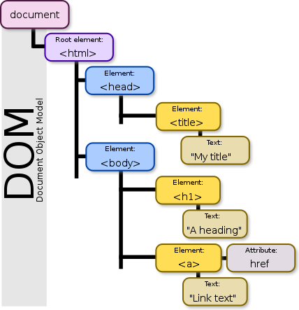

# PRÁCTICA 5 : INTRODUCCIÓN A JAVASCRIPT
    Ejercicios para la comprensión de JavaScript y la 
    Composición del DOM y su estructura en arbol.

## TABLA DE LAS FUNCIONES JAVASCRIPT PARA EL DOM.  

## ESQUEMA DEL ARBOL DOM DEL [FICHERO ENLAZADO](https://campusvirtual.ull.es/1920/pluginfile.php/258285/mod_assign/intro/dom.html).

```
html
│
└───head
│   │
│   └───title
|       |
│       └───DOM
│   
└───body
    │
    └───h1
    |   |
    │   └───Introducción al árbol DOM
    │
    └───p
    |   |
    │   └───El DOM es una interfaz de objeto de un documento HTML, 
    │       representa de forma estructurada el documento y proporciona 
    │       interfaces para su manipulación.
    │
    └───p
    |   │
    |   └───Puedes consultar información en la 
    |   │
    |   └───a---href=https://developer.mozilla.org/es/docs/Referencia_DOM_de_Gecko/Introducci%C3%B3n
    |       |
    │       └───Documnetación de Mozilla
    └───p
    |   |
    │   └───Algunos tipos de datos:
    │
    └───ul
    |   │
    |   └───li
    |   |   |
    |   |   └───document
    |   │
    |   └───li
    |   |   |
    |   |   └───element
    |   │
    |   └───li
    |       |
    |       └───attribute
    │
    └───p
    |   |
    │   └───Introduce tu correo si quieres más información 
    │
    └───form---action=https://www.ull.es
        │   ---method=post
        │
        └───h2
        |   │
        |   └───Ejemplo para el árbol DOM
        │
        └───p
        |   │
        |   └───Puedes introducir tu correo, si quieres suscribirte
        │
        └───div
            │
            └───div
            |    │
            |    └───label---for=newsletterEmailInput
            |    |   │
            |    |   └───E-mail
            |    │
            |    └───input---id=newsletterEmailInput
            │             ---type=email
            │             ---name=email
            │             ---required=
            │             ---placeholder=you@example.com
            │             ---size=30
            |
            └───div
                 │
                 └───button---id=newsletter-submit
                     │     ---class=button neutral newsletter-submit
                     │     ---type=submit
                     |
                     └───Sign up now 

```

    Las etiquetas HTML hijas de otras etiquetas html son nodos hijos en la jerarquía.
    El texto que encierra dicha etiqueta es así mismo un nodo hijo de la propia 
    etiqueta. Sin embargo los atributos están posicionados al mismo nivel. Tal y como
    muestra el siguiente esquema:



> más información en este [link](https://en.wikipedia.org/wiki/Document_Object_Model)

## FUNCIÓN JAVASCRIPT PARA CALCULAR EL CAMBIO ENTRE DIFERENTES MONEDAS

## FUNCIÓN JAVASCRIPT PARA CALCULAR EDAD Y SUELDO

## FUNCIÓN JAVASCRIPT PARA INFORME DE LA CÁNTIDAD DE ELEMENTOS EN EL INICIO

```
Esto es un bloque de código.
```

