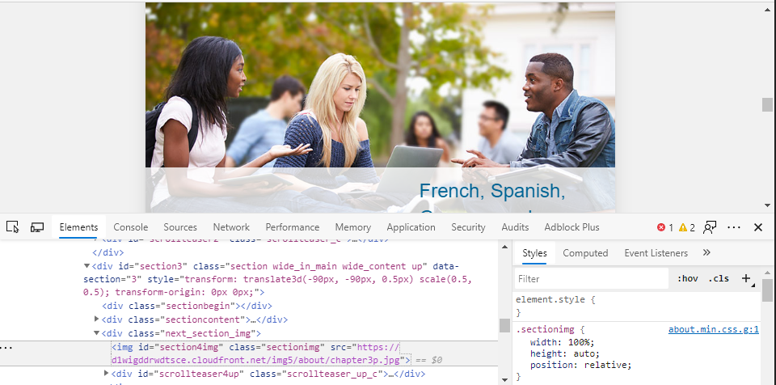

# Documento para el análisis del criterio Percetptible  (WCAG 2.1)
    El objetivo de este documento es localizar faltas de accesibilidad según el perceptible operable de la WCAG.

## Enlaces a las web analizadas 
https://sede.ull.es/


## Ejemplos de inclumplimiento de verificación A y AA
    Pauta 1.1:En la imagen del banner, omiten el atributo alt en img.
    Pauta 1.1: No actualizan las alternativas cuando cambia el contenido no textual.
    Pauta 1.3.1: No utilizan :before y :after con contenido informativo.
    Pauta 1.4.1: Si tienes daltonismo lo más probable es que no veas bien algunos enlaces.
    Pauta 1.4.3: En algunas zonas el contraste entre la letra blanca y el fondo de color azul puede llegar a ser un problema por su poco contraste.
    Pauta 1.4.4: No usan tamaño de contenedores en porcentaje de página.
    Pauta 1.4.4: No hay fuentes grandes de forma predefinida.
    Pauta 1.4.4: No evitan tamaños de fuente menores que los predefinidos por el agente de usuario
    Pauta 1.4.10: No reajustan contenidos usandos grids.
    Pauta 1.4.11: No hay suficiente contraste entre elementos no textuales y el texto.

## Ejemplos de cumplimiento de verificación A y AA
    Pauta 1.1: Usan elementos label para los controles y formularios.
    Pauta 1.3: El contenido puede ser percibido en diferentes dispositivos.
    Pauta 1.3.1: Relaciones transmitidas en la presentación están presentes en el código. Uso de scope, id o header.
    Pauta 1.3.1: Uso adecuado de h1-h6, ol, ul, li.
    Pauta 1.3.2: Uso del atributo dir para textos con diferentes direcciones de lectura.
    Pauta 1.3.2: Ubican el contenido según la estructura.
    Pauta 1.3.2: Controlan el espacio entre letras por CSS y no dejando espacios en blanco.
    Pauta 1.3.4: Utilizan CSS para permitir e contenido en formato vertical y horizontal.
    Pauta 1.3.4: Utilizan controles de mostrar/ocultar para facilitar el acceso a contenidos en diferentes orientaciones (no bloquean la pantalla).
    Pauta 1.3.6: Utilizan ARIA para definir una cadena que etiqueta el elemento actual.
    Pauta 1.4.1: No utilizan únicamente el color para transmitir información o indicar una acción.
    Pauta 1.4.4: El texto puede ser ampliado hasta un 200% por los productos de apoyo sin perder contenido o funcionalidad.
    Pauta 1.4.4: No hay peŕdida de contenido o presentación cuando se redimensiona el texto.
    Pauta 1.4.4: La fuente se ve bien cuando se muestra al 50%.
    Pauta 1.4.10: Utilizan media queries en CSS.

**Página web x: [traductor inglés-español Linguee](hhttps://www.deepl.com/translator)**


- No se cumple la pauta 1.1.1, que trata de ofrecer alternativas a contenido no textual
>   **1.1.1 Proporcionar equivalentes textuales**
>   En este caso varias de las imágenes de la página principal en la que nos encontramos
>   no tienen campo *alt* ni *tile* ni ninguna otra de las alternativas para este propósito.

```html

```



>   Además un video de presentación no tieneuna etiqueta *<track>* que se emplea para
>   incluir subtítulos que dan apoyo a las personas que requieren de una narración de la 
>   imágen. 
```html
<video src="https://d1wigddrwdtsce.cloudfront.net/img5/about/EN-ES/iOS-s.mp4" loop="" id="iPhoneGrossI"></video>
```

## Ejemplos de cumplimiento de verificación A y AA

**Página web x: [traductor inglés-español Linguee](hhttps://www.deepl.com/translator)**


- Se cumple la pauta 1.4, que trata sobre la facilidad de pericibir el contenido de la web
>   **1.4.3 Contraste mínimo**
>   Este criterio lo consideramos cumplido ya que existe bastante contraste entre los 
>   distintos elementos de la página inicial de la web. Se muestra un tono azul oscuro sobre
>   blanco.

 
