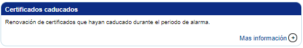
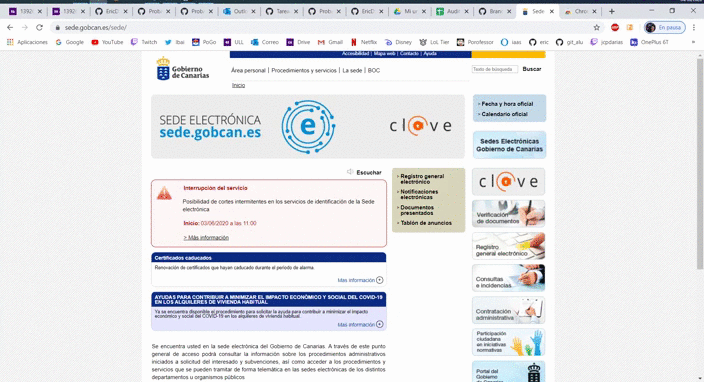
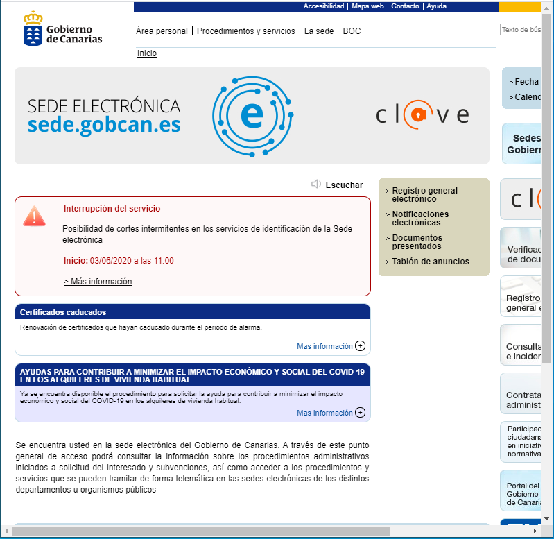

# INFORME ACCESIBILIDAD

## Parte de Alejandro

## Errores encontrados por criterio de conformidad analizado

En este apartado vamos a comentar los principales errores encontrados cuando analizamos la página de la [Sede Electrónica del Gobierno de Canarias](https://sede.gobcan.es/sede/) relacionados con la evaluación de los criterios de conformidad de nivel A y AA.

### Criterios de conformidad nivel A

- **1.3.2 Secuencia significatica:** Con este criterio se pretende que el orden de navegación y lectura (determinado por el orden del código fuente) sea lógico. En la amplia mayoría de las páginas analizadas esto no se cumple, en el punto 2.4.3 se explicará por qué.

- **1.4.1 Uso de color:** Este error también fue generalizado. En muchas de las páginas de la muestra no se podía distinguir con claridad qué era un enlace y qué no, ya que en muchos casos, estos no eran diferenciables de los elementos y textos que les rodean. Un ejemplo de este error es el enlace "Mas información +" el cual está en azul y a primera vista parecería que al pulsar se desplegaría algún acordeón, ya que cuando pasas por encima no se subraya ni parece un enlace. Pero cuando pulsas en él te redirecciona a otra página. El enlace en cuestión es:

- **2.4.3 Orden del foco:** Con este criterio pudimos observar como en la gran mayoría de las muestras, el foco saltaba de una sección a otra sin sentido alguno. Esto puede llegar a ser un problema para personas con deficit de atención o personas mayores. Esto se podría solucionar con *"tabindex="* para poner un orden de prioridad. A continuación, pueden ver un gif donde se ve el problema:

### Criterios de conformidad nivel AA

- **1.3.5 Identificación del propósito del campo:** Este criterio no se cumple en ninguna de las páginas de muestra ya que no especifican el propósito de cada campo que recoge información del usuario por software.

- **1.4.5 Imágenes de texto:** Este error ocurre en varias páginas, hace referencia a que si la misma representación visual puede realizarse usando sólo texto, no deben usarse imágenes para representar ese texto. En el mismo index de nuestra página se puede observar como **sí** usan una imagen para poner el título de la página:

- **1.4.10 Reajuste de elementos:** Este criterio no se cumple ya que la página es muy poco Responsive, se debería de reajustar a la pantalla por muy pequeña que sea o dar la opción de cambiar a un diseño que no requiera scroll para leer una línea de texto. Esto no se cumple en muchas zonas, muestra de ello es que si empiezas a hacer la ventana pequeña, en vez de ir reajustando la secciones o incluso elimnar algunas, lo que hace es que comienza a dejar de verse la parte derecha de la página.

- **1.4.12 Espacio del texto:** Este último error detectado es debido a que no usan medidas relativas para el texto si no que si examinas el código usan tamaños fijos:

## Parte de Eric
