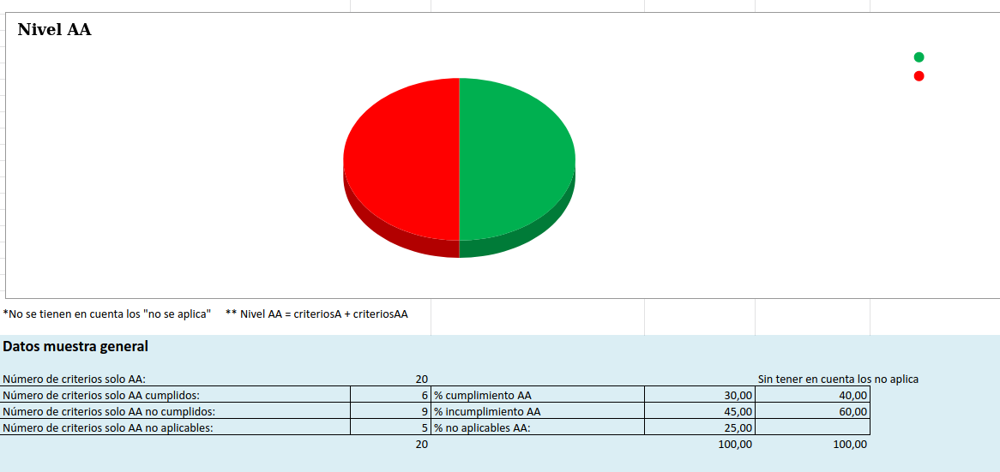
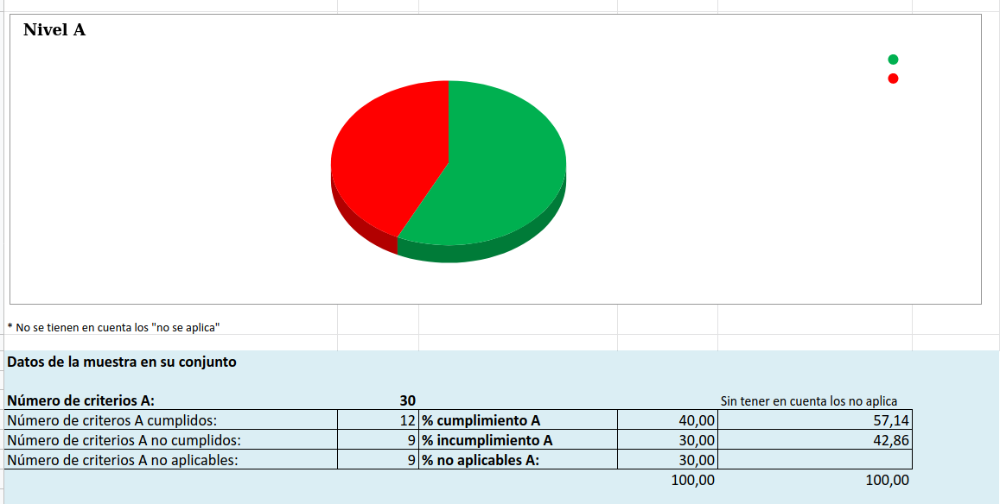
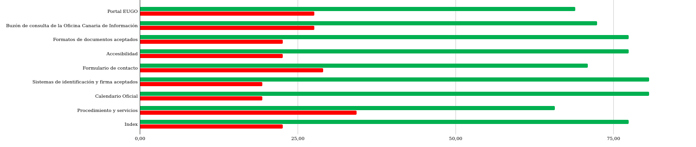
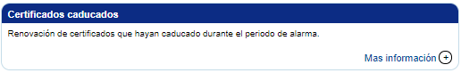
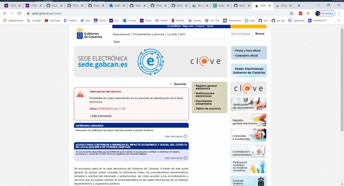
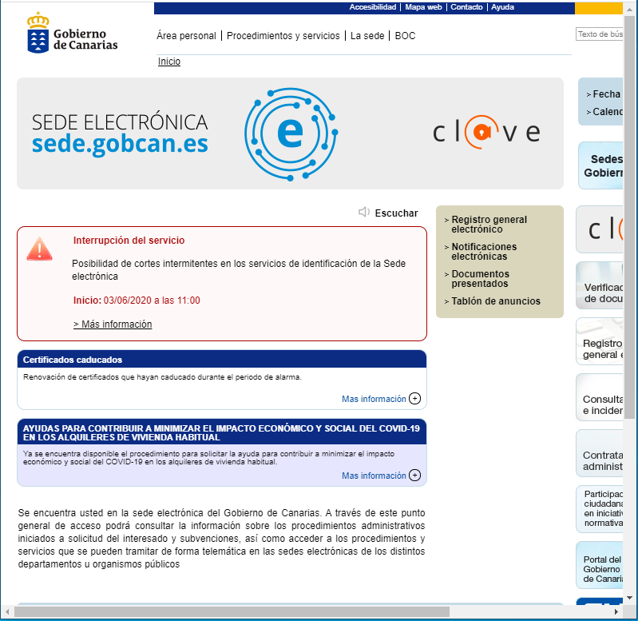
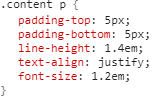

# Informe en profundidad de accesibilidad - Sede Electrónica Gobierno de Canarias
    El presente documento pretende hacer un análisis detallado sobre los factores
    que afectan a la accesibilidad de la sede electrónica del gobierno de canarias.
    Además de un resumen de sus apartados, algunos ejemplos de aquellos errores más 
    frecuentes y las consecuentes sugerencias de mejora para la accesibilidad.

 

Esta adutoría de accesibilidad se ha realizado para la [**sede electrónica del Gobierno de 
Canarias**](https://sede.gobcan.es/sede/). 

Se ha usado para su análisis la herramienta 
AuditTool - WCAG 2.1 de Olga Carreras Montoto.

Además se emplean herramientas de evaluación automática como:
- [WAVES](https://wave.webaim.org/)
- [A11Y Color Contrast](https://color.a11y.com/)
    ···

Los autores del informe son:
- [Alejandro Martín de León](alu0101015941@ull.edu.es)
- [Eric Dürr Sierra](alu0101027005@ull.edu.es)
- [Oscar Cigala Álvarez](alu010101038230@ull.edu.es)

Estos autores pertenecen al prupo 02 de la asignatura de Usabilidad y Accesibilidad  en el curso 2019-2020

 
 
 

> **A continuación se dividirán por apartados las distintas fases del estudio de accesibilidad de la web y los aspectos relativos a su auditoría.**
***

## Éxitos y errores en el cumplimiento de las WCAG 2.1

***

    Se pretende exponer de forma resumida los éxitos y errores obtenidos tras la Evaluación de WCAG 2.1 en las diferentes webs analizadas.

### Éxitos en el cumplimiento

Por lo general, en la gran mayoría de las webs que han sido analizadas a partir de la [Sede Electrónica del Gobierno de Canarias](https://sede.gobcan.es/sede/) los criterios se cumplen en un 45%-50% de los casos, teniendo en cuenta el **resultado AA real** (A+AA). Los éxitos a destacar sobre la web son relativos al manejo del foco, el tamaño de los diferentes elementos de la web e incluso el uso de los diferentes links. 

### Errores en el cumplimiento

En el caso del error de cumplimiento, es bastante menor a los éxitos. En concreto, los criterios que no se cumplen son en torno a un 12%-18%. Estos errores en su mayoría se achacan sobretodo al apartado de código. Los errores más comunes que se han dado son: 

- **Ayuda 1.4.1:** No use el color como el único método para transmitir elementos visuales. (A)
- **Ayuda 1.4.10:** La página es Responsive. (AA) 

*** 

## Cumplimiento de los criterios de conformidad en la página

***
    En este apartado se procede a la evaluación y exposición del cumplimiento  de los criterios de conformidad para las 
    páginas de la muestra escogida que representa a la sede del gobierno de canarias. En nuestro caso, comprobamos hasta
    el nivel AA, que asume los 25 criterios A junto a los 13 AA.

Bajo un vistazo general, si atendemos al sitio (que auna todas las páginas) se puede observar que menos del 50% de los criterios
en este análisis han sido cumplidos tal como muestra el gráfico para el nivel AA:

Sin embargo la balanza se torna más positiva respecto a los criterios de conformidad de nivel A:

Se puede denotar que se alcanza entorno al 60% de criterios cumplidos.

Si atanedemos a las páginas, en un análisis más centrado en un nivel individual se puede observar que aquellas que suponen servicios más cruciales para los usuarios y que están estrechamente vinculados a algún tipo de procedimiento suelen tener mejor puntuación de criterios como es el caso de :
- buzón de consulta.
- sistema de identificación y firmas.

O aquellas páginas que tienen un uso muy recurrido y que aportan información altamente vinuclada a otros anexos del sitio:
- Calendario Oficial.

Sin embargo, si atendemos a la evaluación conjunta de los dos niveles de criterios (que es el caso real), podremos observar como las páginas con mejor puntiación son una mezcla de los dos casos antes presentados: calendario oficial y buzón de consulta.

Haciendo un análisis en cuanto  a los resultados que nos brindan los principios por separado, el porcentaje de aplicación de los criterios de conformidad  no son inferiores al 65% entre las páginas por separado, lo cual indica que si ampliamos el punto de vista la situación no parece ser desastrosa teniendo un promedio del 75% de cumplimiento. Claramente el éxito de los criterios AA al ser más exigente es más bajo y como se anulan aquellos que no se aplican, poniendo una situación más justa donde se aplican los requisitos a los medios aplicados.

La mayoría de éxitos que se cumplen en todas las páginas son aspectos cruciales para la accesibilidad y que son menos flexibles:
- Atajos de teclado  
- orientación de la pantalla
- Contraste

***

## Errores encontrados por criterio de conformidad analizado

***

    En este apartado vamos a comentar los principales errores encontrados cuando analizamos la página de la [Sede Electrónica del Gobierno de Canarias](https://sede.gobcan.es/sede/) relacionados con la evaluación de los criterios de conformidad de nivel A y AA.

### Criterios de conformidad nivel A

- **1.3.2 Secuencia significatica:** Con este criterio se pretende que el orden de navegación y lectura (determinado por el orden del código fuente) sea lógico. En la amplia mayoría de las páginas analizadas esto no se cumple, en el punto 2.4.3 se explicará por qué.

- **1.4.1 Uso de color:** Este error también fue generalizado. En muchas de las páginas de la muestra no se podía distinguir con claridad qué era un enlace y qué no, ya que en muchos casos, estos no eran diferenciables de los elementos y textos que les rodean. Un ejemplo de este error es el enlace "Mas información +" el cual está en azul y a primera vista parecería que al pulsar se desplegaría algún acordeón, ya que cuando pasas por encima no se subraya ni parece un enlace. Pero cuando pulsas en él te redirecciona a otra página. El enlace en cuestión es:

- **2.4.3 Orden del foco:** Con este criterio pudimos observar como en la gran mayoría de las muestras, el foco saltaba de una sección a otra sin sentido alguno. Esto puede llegar a ser un problema para personas con deficit de atención o personas mayores. Esto se podría solucionar con *"tabindex="* para poner un orden de prioridad. A continuación, pueden ver un gif donde se ve el problema:

### Criterios de conformidad nivel AA

- **1.3.5 Identificación del propósito del campo:** Este criterio no se cumple en ninguna de las páginas de muestra ya que no especifican el propósito de cada campo que recoge información del usuario por software.

- **1.4.5 Imágenes de texto:** Este error ocurre en varias páginas, hace referencia a que si la misma representación visual puede realizarse usando sólo texto, no deben usarse imágenes para representar ese texto. En el mismo index de nuestra página se puede observar como **sí** usan una imagen para poner el título de la página:

- **1.4.10 Reajuste de elementos:** Este criterio no se cumple ya que la página es muy poco Responsive, se debería de reajustar a la pantalla por muy pequeña que sea o dar la opción de cambiar a un diseño que no requiera scroll para leer una línea de texto. Esto no se cumple en muchas zonas, muestra de ello es que si empiezas a hacer la ventana pequeña, en vez de ir reajustando la secciones o incluso elimnar algunas, lo que hace es que comienza a dejar de verse la parte derecha de la página.

- **1.4.12 Espacio del texto:** Este último error detectado es debido a que no usan medidas relativas para el texto si no que si examinas el código usan tamaños fijos:

***

## Ejemplos de impacto de los problemas encontrados en los usuarios

***

    En base a los problemas mencionados anteriormente se ejemplificará como podría 
    afectar a los usuarios de la web.

Para un usuario con una visión reducida o nula que el orden del foco no siga un orden correcto podría hacer que este se perdiera por completo y errar en su navegación. confundiría el uso de la web para este usuario, por ello se le haría tedioso y lento el acceso y uso de la plataforma.

Otro problema que reside en la accesibilidad del sitio, que podría afectar gravemente a los usuarios que accedan desde un dispositivo móvil, es  que esta no es responsive e impide el acceso a elementos desde ciertos dispositivos, perdiendo un sector de usuarios muy crucial, ya que hoy en día es impensable no acceder a una página desde un dispositivo móvil o similar.

Dado que es una página que tiene que cubrir un nicho muy amplio al estar dedicado en la ciudadanía debería renovarse en estos aspectos para cumplir el valor cívico que implica este tipo de servicios. La amplitud de medios de acceso es crucial (sobre todo en casos de urgencia) a la hora de acceder a los servicios gubernamentales.

***

## Sugerencias para la mejora de la accesibilidad

***

Tal y como se ha visto en los puntos anteriores, y apoyándonos en AudiTool WCAG 2.1, herramienta con la que hemos realizado el estudio, se encuentra un bajo porcentaje de errores de accesibilidad. La gran mayoria de dichos errores son relativos a las dimensiones de la pantalla, no se considera una web responsiva. Para poder solucionar esto, se podría realizar varias técnicas, como puede ser **Mobile-first**. Ésta consiste en pensar y diseñar la web en primer lugar para el dispositivo más limitado y, a partir de ahí, crear los diseños para una mayor dimensión, priorizando contenidos y funcionalidades.

Como posible sugerencia, sería además, en la medidada de lo posible liberar de carga de links y elementos la página principal de la web. Sintetizar elementos e ideas podría ayudar a que el usuario no perdiera demasiado tiempo en acceder a los elementos que le interesa.
