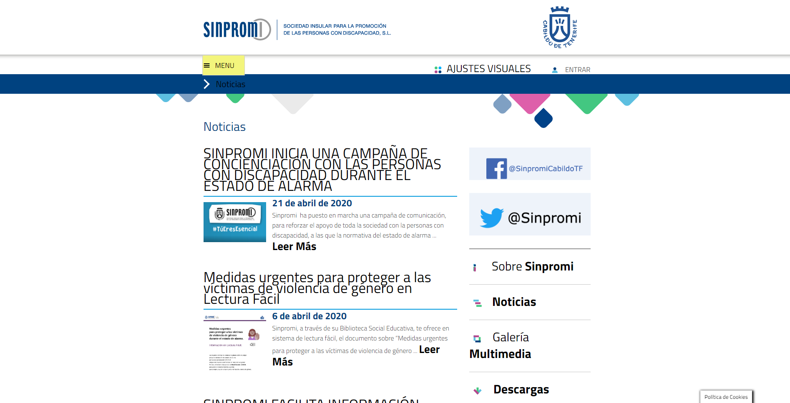

# INFORME Criterios - Técnicas WCAG 2.1 (II) - Principio Comprensible y Robusto

Se pretende analizar y explicar cada una de las pautas que componen el WCAG 2.1 Comprensible-Robusto sobre dos webs de ejemplo. Las webs a analizar son las siguientes: 
- [Sinpromi](https://sinpromi.es/)
- [Noticias Sinpromi](https://sinpromi.es/noticias)

***
## Análisis de los criterios A, AA de los principios Comprensible y Robusto sobre la web [Sinpromi](https://sinpromi.es/)

Se explicacarán y analizarán todos los criterios y pautas sobre [Sinpromi](https://sinpromi.es/).

***
## Análisis de los criterios A, AA de los principios Comprensible y Robusto sobre la web [Noticias Sinpromi](https://sinpromi.es/noticias)
 
Se explicacarán y analizarán todos los criterios y pautas sobre [Noticias 
Sinpromi](https://sinpromi.es/noticias).


### Criterios relacionados con las pautas de  Comprensible:

**Pauta 3.1**

    Fácil lectura y comprensión de los contenidos

- Criterio 3.1.1 

    Este criterio se cumple, queda demostrado al revisar el uso de la etiqueta que proporciona información sobre el lenguaje:

    ```html
    <html lang="es">
    
        ···
    
    </html>
    ```

- Criterio 3.1.2 

    Cada uno de los elementos (por ejemplo las noticias) queda marcado en cuanto a lenguasje de la misma manera que el anterior apartado. Por lo que podemos decir que se cumple dicho criterio.

**Pauta 3.2**

    Manejo predecible en el diseño de páginbas web


- Criterio 3.2.1 

    Para realizar un cambio de contexto es necesario *"clickar"* el elemento que lo ofrece (o pulsar *enter*), por ello se puede afirmar que este criterio se cumple.

- Criterio 3.2.2 
    El componente de menú de navegación, por ejemplo, no inicia un cambio de contexto, sino que se  abre en la web dando la oportunidad de revertirlo. Además indica el foco tras su selección. De la misma manera se pueden modificar los estados de los componentes en materia de tamaño y apariencia sin requerir cambiar el contexto.

    <div style="display: flex; justify-content: center; align-items: center; ">
      
      :arrow_right:
      
    </div>

- Criterio 3.2.3    

- Criterio 3.2.4 

**Pauta 3.3**

    Ayuda a los usuarios a evitar y corregir de errores 

- Criterio 3.3.1    

- Criterio 3.3.2    

- Criterio 3.3.3    

- Criterio 3.3.4 


### Criterios relacionados con las pautas de  Robusto:

**Pauta 4.1**
