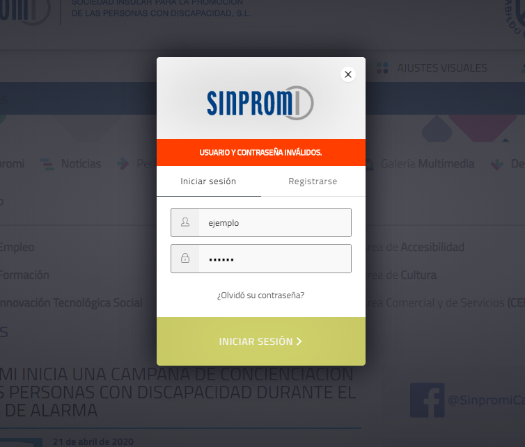
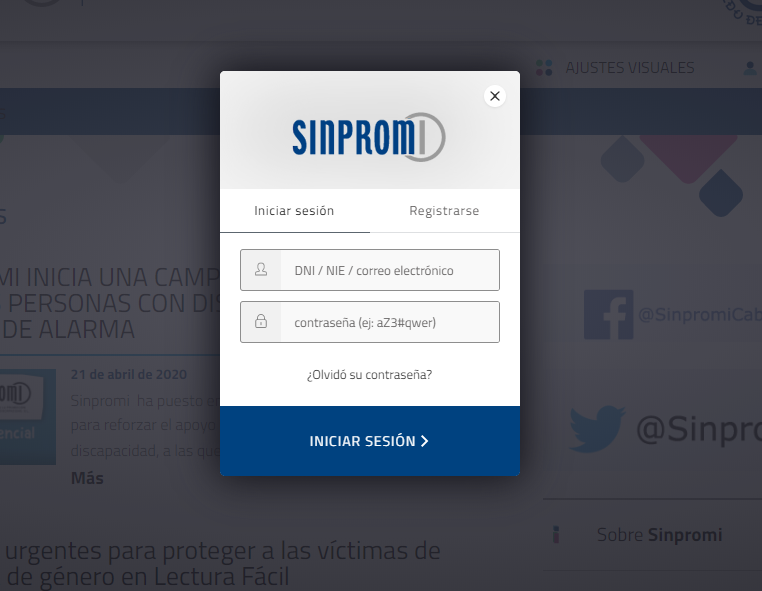

# INFORME Criterios - Técnicas WCAG 2.1 (II) - Principio Comprensible y Robusto

Se pretende analizar y explicar cada una de las pautas que componen el WCAG 2.1 Comprensible-Robusto sobre dos webs de ejemplo. Las webs a analizar son las siguientes: 
- [Sinpromi](https://sinpromi.es/)
- [Noticias Sinpromi](https://sinpromi.es/noticias)

***
## Análisis de los criterios A, AA de los principios Comprensible y Robusto sobre la web [Sinpromi](https://sinpromi.es/)

Se explicacarán y analizarán todos los criterios y pautas sobre [Sinpromi](https://sinpromi.es/).

***
## Análisis de los criterios A, AA de los principios Comprensible y Robusto sobre la web [Noticias Sinpromi](https://sinpromi.es/noticias)
 
Se explicacarán y analizarán todos los criterios y pautas sobre [Noticias 
Sinpromi](https://sinpromi.es/noticias).


### Criterios relacionados con las pautas de  Comprensible:

**Pauta 3.1**

    Fácil lectura y comprensión de los contenidos

- Criterio 3.1.1 

    Este criterio se cumple, queda demostrado al revisar el uso de la etiqueta que proporciona información sobre el lenguaje:

    ```html
    <html lang="es">
    
        ···
    
    </html>
    ```

- Criterio 3.1.2 

    Cada uno de los elementos (por ejemplo las noticias) queda marcado en cuanto a lenguasje de la misma manera que el anterior apartado. Por lo que podemos decir que se cumple dicho criterio.

**Pauta 3.2**

    Manejo predecible en el diseño de páginbas web


- Criterio 3.2.1 

    Para realizar un cambio de contexto es necesario *"clickar"* el elemento que lo ofrece (o pulsar *enter*), por ello se puede afirmar que este criterio se cumple.

- Criterio 3.2.2 
    El componente de menú de navegación, por ejemplo, no inicia un cambio de contexto, sino que se  abre en la web dando la oportunidad de revertirlo. Además indica el foco tras su selección. De la misma manera se pueden modificar los estados de los componentes en materia de tamaño y apariencia sin requerir cambiar el contexto.

    <div style="display: flex; justify-content: center; align-items: center; ">
      
      
    </div>

- Criterio 3.2.3    
    El orden de los menús de navegación permiten acceder a todos los elementos desde cualquier otro punto de la página sin cambiar su orden, por lo que podemos definir este criterio como cumplido.

- Criterio 3.2.4 
    Las noticias se identifican todas bajo la misma estr4uctura, por ello los componentes se identifican de manera consistente
    <div style="display: flex; justify-content: center; align-items: center; ">
      
    </div>


**Pauta 3.3**

    Ayuda a los usuarios a evitar y corregir de errores 

> Para estos criterios nos fijaremos ene el modal de inicio de sesión de la página. Se accede pulsando "*ENTRAR*"

- Criterio 3.3.1    

    Se indican los campos que han dado error en el campo seleccionado y de manera textual. Por ejemplo en el usuario.

    <div style="display: flex; justify-content: center; align-items: center; ">
      
    </div>


- Criterio 3.3.2    
    En el mismopp elemento mencionado en el anterior punto se aprecia un ejemplo de este caso, a la hora de introducir los datos rerequeridos hay un ejemplo de lo que se debería de introducir o el tipo de formato que admite:

    <div style="display: flex; justify-content: center; align-items: center; ">
      
    </div>

### Criterios relacionados con las pautas de  Robusto:

**Pauta 4.1**

  Compatible: Maximizar la compatibilidad con las aplicaciones de usuario actuales y futuras, incluyendo las ayudas técnicas.

- **Criterio 4.1.1 (Nivel AA):** La web sí cumple este criterio ya que, podemos encontrar que todos los elementos tienen las etiquetas de apertura y cierre completas, están anidados de acuerdo a sus especificaciones, no contienen atributos duplicados y no hemos encontrado ningún ID repetido. Esto se puede comprobar mediante las técnicas de validadores automáticos, además de que se nota que sigue el estándar HTML. A continuación, se puede ver una captura del código de sección de [noticias](https://sinpromi.es/noticias/) de la página de [Sinpromi](https://sinpromi.es/) donde se puede observar como se cumple:


- **Criterio 4.1.2 (nivel A):** Sí lo cumple ya que, para todos los componentes de la interfaz de usuario el elemento y la función pueden ser determinados por software. Además, el usuario no tiene que aportar nada así que no hay que especificarlo por software ni consultar los cambios. Alguna técnica que se puede emplear para llevar a cabo esto es la ARIA14: Usar aria-label para proporcionar una etiqueta invisible donde no se puede usar una etiqueta visible

- **Criterio 4.1.3 (nivel A):** Este criterio no puede ser comprobado en esta página ya que no hay ningún temporizador o formulario que requiera de tiempo y te pueda mandar un aviso. Este criterio viene a decir que aunque los mensajes de error y las advertencias pueden ser mensajes de estado, no lo son si cambian el contexto al establecer el foco en el error. Este criterio beneficia a aquellas personas que usan tecnología de asistencia, como lectores de pantalla.