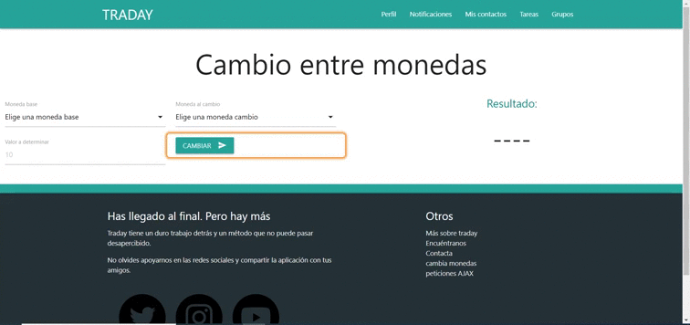
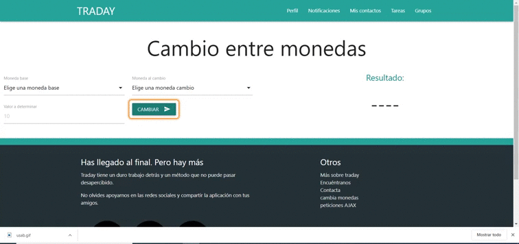
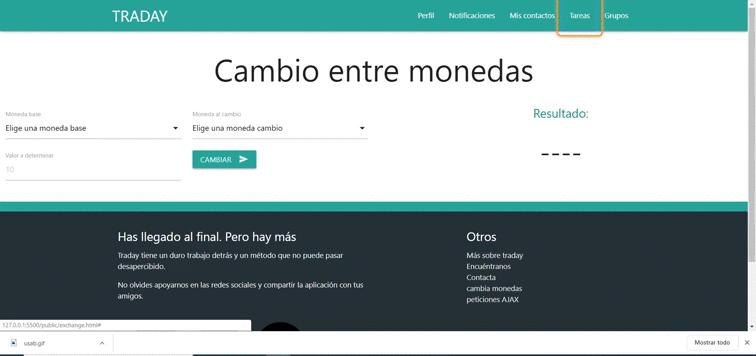
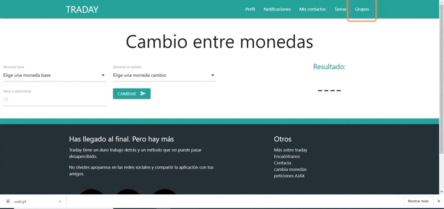
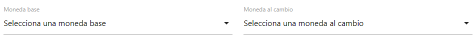
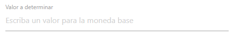

# Ejercicio de WAI-ARIA: Revisón de páginas con formularios:
    El siguiente documento va a registrar el cambio de accesibilidad proporcionado por el etiquetado
    de propiedades WAI-ARIA de la página en algunos de sus elementos de interacción 
***
## [Página principal](https://traday-362aa.web.app/index.html)
***
    En el apartado de la página principal se va a hacer especial hincapié ,pese a que sea 
    un error presente en la mayoría, a la barra de navegación ya que esta ofrece una vista
    lateral responsiva y una superior para dispositivos más grandes. Además se revisará que 
    el foco pase por todos los elementos.

El primer problema que nos encontramos es que la herramienta de chromevox se ve forzada a 
leer los dos menús cuando se explora la página ya que para la herramienta de tabulación esta 
está presente y no oculta. Además los enlaces de la lista no son 100% accesibles desde teclado
y el menú debe poderse cerrar. Para solucionar esto se ha optado por establecer el *tabindex=-1* atrubito el cual se cambia a *0* mediante javascript para activar su interacción con un enter o un click. Cuando se sale de este el *tabindex*
vuelve a ser *0*

los códigos quedarían así:
```html
      function changeValues(e)  
      {
        if(e.keyCode==13)
        {
          list = document.getElementById("traday-nav").getElementsByTagName("LI");
          console.log(list);
          for (let i = 0; i < list.length; i++)
          {
            list[i].childNodes[0].tabIndex=0;
          }
        }
      }

      function nullValues(e)  
      {
        if(e.keyCode==13)
        {
          list = document.getElementById("traday-nav").getElementsByTagName("LI");
          console.log(list);
          for (let i = 0; i < list.length; i++)
          {
            list[i].childNodes[0].tabIndex=-1;
          }
        }
      }
```
Y en el siguiente .gif se confirma su correcto funcionamiento:
   


Otro de los problemas se encontraba en el uso de los botones, los cuales al ser enlaces no funcionaban con la tecla enter.
Para solucionarlo se ha cambiado a botones. Además estos en lugar de leer su contenido, chromevox debe nombrar su propósito. Por ello se ha editado también esta característica.


Lo siguiente a revisar son los modales abiertos por los propios botonoes. A estos se les debe añadir el rol "dialog" para que el foco sepa la región en la que puede y no puede actuar. También se emplea *aria-labeledby* para indicarle, mediante el id, de qué elemento va a tomar el nombre que debe indicar y  *aria-describedby* para proporcionar una descripción de lo que se hace. 

Se han incluido también las etiquetas correspondientes de nombramiento y requerimiento a los formularios y botones que contienen los modales. (*aria-label* *aria-required*)


En el siguiente .gif se muestra su correcto funcionamiento:


***
## [Página Perfil](https://traday-362aa.web.app/profile.html)
***
Haciendo uso de la herramienta Chrome Vox, se ha visto una serie de errores sobre esta página de nuestro sitio web. Todos éstos serán detallados y se les pondrá solución a continuación.

### Primer error detectado - Error en el foco

Se ha detectado una incidencia en parte del código que impide acceder mediante el foco a los títulos de los distintos apartados de la web de perfil. Se trata de un problema grave de accesibilidad, ya que, si no fuese posible de leer que determinados títulos, el usuario podría perder el hilo de la web.
A continuación se muestra un gif que muestra que al foco no se le permite llegar a los títulos de la web:


Para corregir el error que se detalla con anterioridad, se ha tenido en cuenta el uso de la etiqueta **tabindex="0"**. Con esta se consigue que el foco tenga en cuenta dicha parte del código. Este proceso ha sido usado, en los títulos de "Grupos", "Contactos Favoritos" y además de "Actividad Reciente" que en un principio no eran accesibles mediante el uso del foco. Se mostrará a continuación  la parte del código que ha sido editada:

```html
<div tabindex="0" aria-label="Grupos">
    <h5 class="white-text"> Grupos </h5>
</div>
```

Además, se mostrará proximamente un gif con el resultado:


### Segundo error detectado - Error foco II

Se trata de además otro fallo en la selección mediante el foco, en este caso se encuentra en el apartado de "Actividad Reciente". En él, no se puede acceder al contenido de los diferentes acordeones ya que el foco los omite. Sucede de la siguiente manera: 


Para corregir este error, al igul que en el caso anterior hemos hecho uso de la etiqueta **tabindex="0"**, el código correspondiente al mismo ha sido de la siguiente manera:

```html
<li>
    <div class="collapsible-header">
    <i class="material-icons">filter_drama</i>
    First
    <span class="new badge">4</span></div>
    <div tabindex="0" class="collapsible-body blue-grey lighten-4"><p>Lorem ipsum dolor sit amet.</p></div>
</li>
```
De esta manera, el foco si se podrá centrar en el contenido del acordeón, tal y como se muestra en el gif a continuación:


### Tercer error detectado - Error foco III

Nuevamente, el foco no es capaz de acceder de forma normal hasta el bloque de perfil de usuario. Es aquí donde volvemos a hacer uso de la etiqueta **tabindex="0"** para que los elementos sean alcanzados por el foco. Además, al encontrarse una imágen es de importancia de que esta sea etiquetada adecuadamente para que pueda ser leida a través del intérprete. En este caso se ha hecho uso de la etiqueta **aria-label="Imagen de usuario"**. Esta vez, al ser usado el foco, al pasar por la imagen se escuchará "Imagen de Usuario". Se mostrará a continuación las líneas de código que han sido editadas para conseguir esta labor: 

```html
         <!-- notice the "circle" class-->
        </div>
        <div class="col s6">
            <span tabindex="0" class="black-text">
                Lorem ipsum dolor sit amet consectetur.
            </span>
        </div>
    </div>
    <div class="row valign-wrapper">
        <div class="col s12 center-align" aria-label="Usuario">
            <h4 tabindex="0">Usuario</h4>
```

Y como ejemplo visual, se adjunta a continuación el paso del foco por este bloque de Perfil de Usuario.


***
## Página [cambio de monedas](https://traday-362aa.web.app/exchange.html) 
***
    En esta sección nos vamos a encargar de analizar los problemas que nos encontremos en nuestra página, concretamente en la parte que implementamos del cambio de moneda. Esta parte de la página es de alto riesgo para la accesibilidad ya que contiene formularios que, si no tratamos y etiquetamos de forma correcta, un lector de pantalla como Chrome Vox podría perderse o saltarse algo importante. Por ello, a continuación pondremos los errores que hemos ido encontrando tras usar Chrome Vox y cómo los hemos solucionado mediante el uso de WAI-ARIA.

    
### Error 1

Uno de los primeros errores que nos encontramos nada mas empezar fue que a la hora de moverse por la página con tabulador, nunca podíamos acceder con el foco a la zona del resultado. Esto es un problema ya que si una persona con deficiencia visual quisiera usar nuestro cambio de moneda, jamás podría escuchar cual es el resultado del cambio. En el siguiente gif se puede ver el error comentado:



La solución que encontramos usando WAI-ARIA fue usar la etiqueta **tabindex=0**, con esto sí que conseguimos que a la hora de tabular saltase el foco de Cambiar a Resultado. En el gif que mostramos a continuación se puede ver:



### Error 2

Este error es muy parecido al error 1, en este caso, cuando navegábamos con el tabulador por el menú superior, nos saltaba el foco de Grupos a Moneda base, sin pasar por el título **Cambio entre monedas**, el cual nos pareció importante ya que una persona con algún tipo de deficiencia visual tiene que saber que va a acceder a la sección donde podrá realizar el cambio de moneda. En el siguiente gif se puede ver el error en cuestión:



La solución para esto fue la misma que en el anterior error, al añadir la etiqueta **tabindex=0** conseguimos que el foco pasara por el título de cambio de monedas al saltar de Grupos a Moneda Base. En el gif siguiente se puede ver:




### Error 3

Cuando el foco pasaba por el botón para cambiar, Chrome Vox decía "Cambiar send". Esto se debía a que en el botón, además de la palabra cambiar, sale un avión de papel, el cual recibe este nombre y el lector de pantalla lo nombraba. A continuación dejo el fragmento de código en cuestión:

```
<button class="btn waves-effect waves-light" 
        value="click"
        type="button"
        id="myButton"
        onclick="convertCurrency(this.form)">Cambiar
    <i class="material-icons right">send</i>
</button>
```

Para solucionar esto, implementamos la etiqueta aria-label="", la cual nos permite especificar una string para usar como etiqueta accesible. Es decir, evita que el lector de voz diga "send" y diga lo que pongamos entre las "". En nuestro caso pusimos aria-label="moneda" y así Chrome Vox al pasar por este botón dice "Cambiar moneda" en vez de "Cambiar send". Con esto hemos logrado que una persona que use algún lector de pantalla tenga más claro para que sirve.

### Errores menores

Por último, vamos a comentar algunos "errores" menores que encontramos a la hora de usar un lector de pantalla como Chrome Vox.

- Lo primero es que cuando el foco pasaba por moneda base y moneda al cambio, no quedaba muy claro si el usuario tenía que escribir o seleccionar, la solución que encontramos fue modificar el texto y poner "Seleccione una moneda base" y "Selecciona una moneda al cambio". Con esto estamos seguros que una persona con algún tipo de deficiencia visual sabrá que tiene que seleccionar y no escribir en el formulario.



- Este error menor es muy parecido que el anterior, ya que en valor a determinar teníamos puesto el número 10, para así dar a entender a una persona que tenga buena visión que ahí tenía que poner un número. El problema es que si la persona está usando un lector de pantalla, la voz decía simplemente "diez" y esto era muy poco intuitivo, así que lo modificamos por "Escriba un valor para la moneda base". Con esto, el lector de pantalla diría esa frase y a la persona con falta de visión le quedaría muy claro que ahí era donde tenía que introducir un número.


