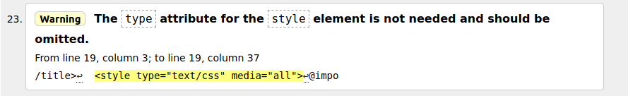
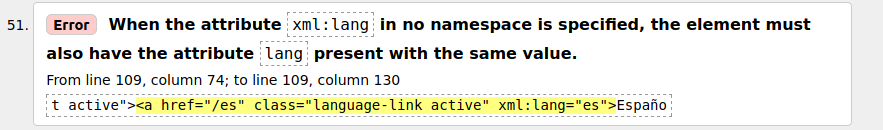
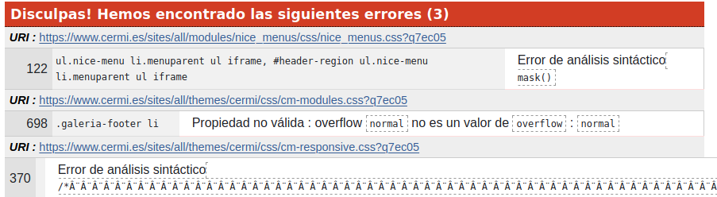
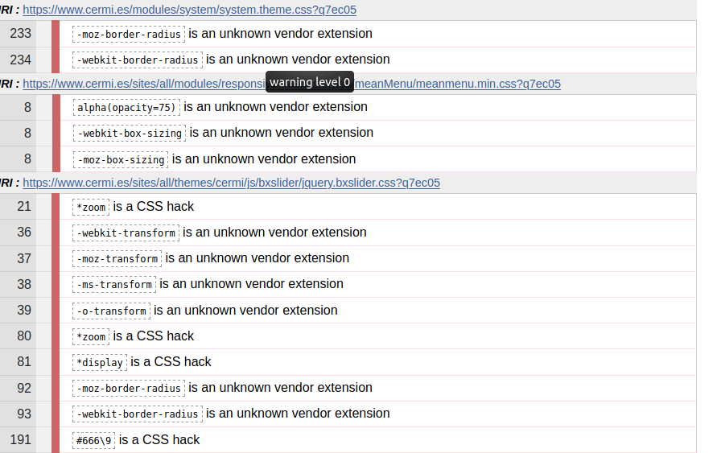
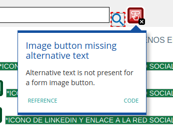
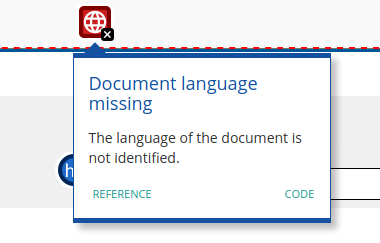
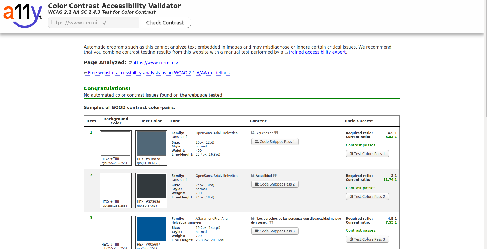

# INFORME Evaluación automática de la accesibilidad

Se pretende analizar y hacer uso de la evaluación automática de la accesibilidad que proporcionan los validadores HTML y CSS del W3C, WAVE y contraste de colores sobre las páguinas de inicio de los siguientes sitios:

- [Cermi]("https://www.cermi.es")
- [Cabildo de Tenerife]("https://www.tenerife.es/portalcabtfe/es/")
- [La Caixa]("https://www.caixabank.es/index_es.html")

***
## Evaluación automática de la web [Cermi]("https://www.cermi.es")
***

Se analizarán por separado las evaluaciones automáticas realizadas por cada herramienta sobre la web [Cermi]("https://www.cermi.es")

### Validadores HTML y CSS del W3C

- **Validador HTML**
<<<<<<< HEAD

- **Validador CSS** 

### WAVE

=======

Para analizar el código HTML se ha hecho uso de la herramienta de [validación HTML](http://validator.w3.org) del W3C.

Una vez introducimos el link de la web a analizar, se muestra una serie de conflictos y warnigns. En total se registran 61 advertencias y errores para la web Cermi.
Los warnings que se nos presentan en sí mismos, se muestran elementos que realmente no son necesarios y deberían de ser omitidos. Un ejemplo de ello se muestra a continuación.

Por otro lado, los errores que se muestran referentes al código HTML de la web, son en su mayoría referentes a fallos a la hora de establecer atributos. Estos errores no entorpecen la funcionalidad de la página en cuestión.

- **Validador CSS** 
>>>>>>> evaluacionAutomatica-Cermi

Para analizar el código CSS se ha hecho uso de la herramienta de [validación CSS](http://jigsaw.w3.org/css-validator/) del W3C.

<<<<<<< HEAD
### Contraste de colores

=======
Por esta parte, también se nos muestran una serie de warnigns y errores. Los errrores encontrados se tratan de dos errores sintáticos y el uso de una propiedad no válida para una función. Éstos se muestran a continuación:
>>>>>>> evaluacionAutomatica-Cermi

Los warnings pertenecientes a esta web, en su gran mayoría se tratan del error "(...) is a unknown vendor extension". Estos tipo de warning es a causa de que el prefijo del mismo fue creado por un explorador específico, y por tanto, W3C no lo reconoce como parte del código de CSS.

### WAVE

Después de analizar la web con WAVE se nos muestran exactamente 15 errores y 7 advertencias. Los errores graves vienen dadas sobretodo por la falta de texto alternativo a imágenes, tal y como se muestra a continuación: 

El siguiente error que se nos muestra, es la ausencia de un documento de lenguaje definido.

### Contraste de colores

Para analizar el Contraste de Colores sobre la web de [Cermi]("https://www.cermi.es") se ha hecho uso de la herramienta [A11Y]("https://color.a11y.com/Contrast/"). Una vez introducido el link de la web a analizar, se muestra de que ésta no presenta problemas referidos a la elección de contraste de colores. 

***
## Evaluación automática de la web [Cabildo de Tenerife]("https://www.tenerife.es/portalcabtfe/es/")
***

Se analizarán por separado las evaluaciones automáticas realizadas por cada herramienta sobre la web [Cabildo de Tenerife]("https://www.tenerife.es/portalcabtfe/es/")

### Validadores HTML y CSS del W3C

### WAVE

### Contraste de colores

***
## Evaluación automática de la web [Cabildo de Tenerife][La Caixa]("https://www.caixabank.es/index_es.html")

***

Se analizarán por separado las evaluaciones automáticas realizadas por cada herramienta sobre la web [La Caixa]("https://www.caixabank.es/index_es.html")

### Validadores HTML y CSS del W3C

### WAVE

### Contraste de colores