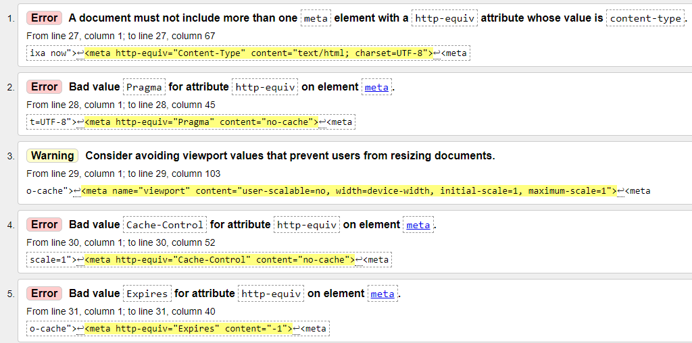
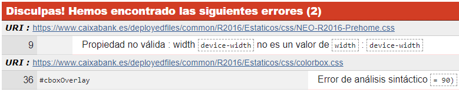
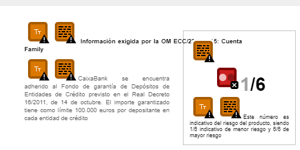
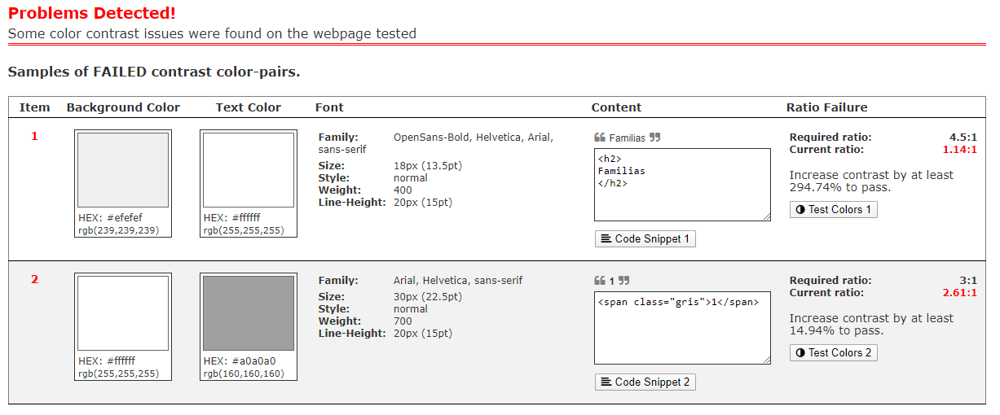

# INFORME Evaluación automática de la accesibilidad

Se pretende analizar y hacer uso de la evaluación automática de la accesibilidad que proporcionan los validadores HTML y CSS del W3C, WAVE y contraste de colores sobre las páguinas de inicio de los siguientes sitios:

- [Cermi]("https://www.cermi.es")
- [Cabildo de Tenerife]("https://www.tenerife.es/portalcabtfe/es/")
- [La Caixa]("https://www.caixabank.es/index_es.html")

***
## Evaluación automática de la web [Cermi]("https://www.cermi.es")
***

Se analizarán por separado las evaluaciones automáticas realizadas por cada herramienta sobre la web [Cermi]("https://www.cermi.es")

### Validadores HTML y CSS del W3C

### WAVE

### Contraste de colores

***
## Evaluación automática de la web [Cabildo de Tenerife]("https://www.tenerife.es/portalcabtfe/es/")
***

Se analizarán por separado las evaluaciones automáticas realizadas por cada herramienta sobre la web [Cabildo de Tenerife]("https://www.tenerife.es/portalcabtfe/es/")

### Validadores HTML y CSS del W3C

### WAVE

### Contraste de colores

***
## Evaluación automática de la web [Cabildo de Tenerife][La Caixa]("https://www.caixabank.es/index_es.html")

***

Se analizarán por separado las evaluaciones automáticas realizadas por cada herramienta sobre la web [La Caixa]("https://www.caixabank.es/index_es.html")

### Validadores HTML y CSS del W3C

Respecto al [validador HTML de W3C](http://validator.w3.org) en la página de [La Caixa](https://www.caixabank.es/index_es.html) nos han aparecido 7 errores y 27 alertas. Los primeros errores que nos salen están relacionados con el atributo meta, en principio estos errores no tienen un impacto significativo en la accesivilidad:

En cuanto al error *"Stray end tag link"* probablemente sea debido a que la etiqueta *link* no esté abierto al principio. Por último, sale un error *"Bad value for attribute id on element div: An ID must not be the empty string"* que sí es un fallo más grave ya que hay un id="" que no tiene ningún nombre. Esto puede confundir a los lectores de pantalla y dificultar la accesivilidad.

Respecto al [validador CSS de W3C](http://jigsaw.w3.org/css-validator/) en la página de [La Caixa](https://www.caixabank.es/index_es.html) nos han aparecido 2 errores y 289 alertas:

Respecto al primer error simplemente nos indica que hay una propiedad no válida para width que han llamado *"device-width"*. Este error no debería suponer un problema muy grande para la accesibilidad aunque si habría que cambiarlo. Respecto al segundo error *"cboxOverlay"* nos dice que hay un "error sintáctico = 90" 

### WAVE

La herramienta [WAVE](http://wave.webaim.org/?lang=es) es bastante útil para facilitar la accesibilidad según las pautas de WCAG.

Los únicos errores que detecta esta aplicación en la página de [La Caixa](https://www.caixabank.es/index_es.html) son de contraste, los cuales serán explicados con más detalle en el apartado de Contraste de colores. Además, podemos encontrar algunas alertas relacionadas con el tamaño del texto, ya que en algunos puntos se podría dificultar con esto a personas con falta de vista por ser tan pequeño. Esto se puede solucionar de la forma más simple que es aumentarlo de tamaño:

También hay algunas alertas porque hay links redundantes y otras porque hay títulos redundantes, lo que podría llegar a ser un problema para personas que se pueden perder facilmente o distraer. Esto puede ser solucionado con técnicas como la eliminación o modificación de estos para poder evitarlo.

### Contraste de colores

Tras usar la página web de [contraste de color](https://color.a11y.com/Contrast/), hemos llegado a la conclusión de que la página de [La Caixa](https://www.caixabank.es/index_es.html) cumple bastante bien con las pautas de contraste de color. Solo son destacables dos errores ya que hay letras en color blanco y con fondo gris, que puede dificultar la visualización para aquellas personas con algún tipo de disfuncionalidad visual. Los errores son los siguientes:

Estos errores son facilmente solucionables con técnicas como aumentar el contraste hasta 4,5:1 o con señales visuales adicionales cuando las diferencias de color transmiten información.