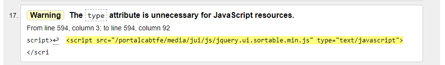
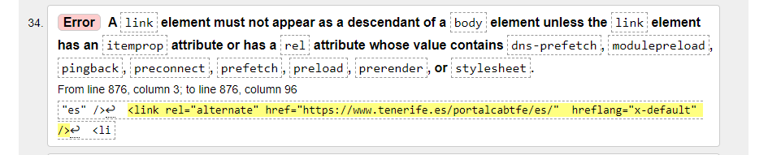
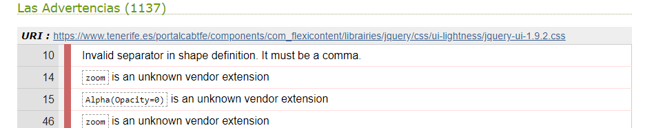
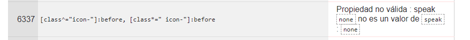
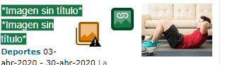
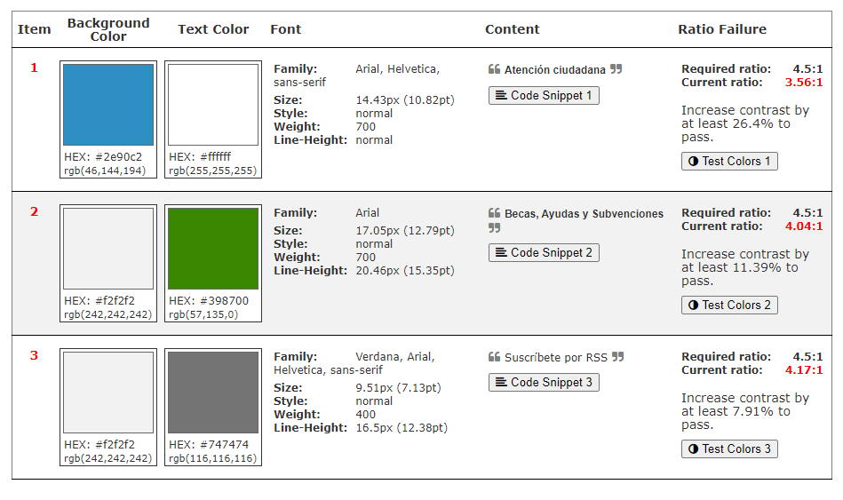
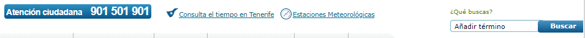

# INFORME Evaluación automática de la accesibilidad

Se pretende analizar y hacer uso de la evaluación automática de la accesibilidad que proporcionan los validadores HTML y CSS del W3C, WAVE y contraste de colores sobre las páguinas de inicio de los siguientes sitios:

- [Cermi]("https://www.cermi.es")
- [Cabildo de Tenerife]("https://www.tenerife.es/portalcabtfe/es/")
- [La Caixa]("https://www.caixabank.es/index_es.html")

***
## Evaluación automática de la web [Cermi]("https://www.cermi.es")
***

Se analizarán por separado las evaluaciones automáticas realizadas por cada herramienta sobre la web [Cermi]("https://www.cermi.es")

### Validadores HTML y CSS del W3C

### WAVE

### Contraste de colores

***
## Evaluación automática de la web [Cabildo de Tenerife]("https://www.tenerife.es/portalcabtfe/es/")
***

Se analizarán por separado las evaluaciones automáticas realizadas por cada herramienta sobre la web [Cabildo de Tenerife]("https://www.tenerife.es/portalcabtfe/es/")

### Validadores HTML y CSS del W3C

 

Resultado general del **Análisis HTML:**

    Tras pasar la página web del Cabildo de Tenerife por la herramienta surgen 38 registros de análisis. La mayoría son warning, además, relacionados con el mismo tipo de aviso. Se hace mención a que el atributo "type" no es usado por recursos de JavaScript

    Sin embargo este hecho no afecta a la accesibilidad del sitio.

    Por otro lado los errores que son detectados, en su mayoría, no afectan gravemente a la 
    accesibilidad de la página, son producto de un uso no estandarizado de algunas propiedades.
    Sin embargo hay varios un errores denominado como:

>"A link element must not appear as a descendant of a 
    body element unless the link element has an itemprop attribute or has a rel attribute whose 
    value contains"

    Esto podría provocar errores y confusión a la hora de organizar los elementos de la web y en su posterior navegación por medio de otras herramientas.

 
 

Resultado general del **Análisis CSS:**
    
    Una vez más la mayoría de registros de análisis que nos vuelca la herramienta son advertencias. Siendo 8 de los registros errores de entre los cuales se pueden abstraer dificultades de accesibilidad.

    La Mayoría de advertencias sobre CSS  se deben a uso no estandar o menos ortodoxo de las 
    propiedades.

    Haciendo hincapié en el análisis de errores la mayoría pueden deberse al uso de framework
    y JS al calcular propiedades y apariencias. Este tipo de errores no supone, en la mayoría
    de los casos un impedimento que penalice la accesibilidad. De entre ellos el que más se 
    acerca a esta situación es el siguiente:

>   Propiedad no válida : speak none no es un valor de speak : none

    Este podría estar invalidando de manera involuntaria algunas herramientas de control por voz.

 
 

### WAVE

Resultado general del **Análisis WAVE** para la accesibilidad según **WCAG:**

    Tras ejecutar el analizador con esta página salen solamente dos errores graves además de 4 errores de contraste. Sin embargo si lo comparamos con los puntos positivos son superados por estos que son 25.

    También cabe destacar que la estructura de jerarquía HTML es limpia, concisa y no redundante en la mayoría de sus puntos. Algunos de los elementos, tal y como lo señalan los avisos, la estrtuctura es redundante en las imágenes dado que presentan el mismo texto alternativo donde, además, este no explica la imágen, no poniéndole título. Esto podría difuminar la imagen de la web si se usase con un explorador por lectura de la misma.

 
 

### Contraste de colores

Resultado general del **análisis de contraste** de la herramienta **a11y:**

    Tras ejecutar el análisis de contraste saltan tres errores  en contraposición a los 4 de la anterior herramienta.Se podrían interpretar como graves. No se alejan demasiado del ratio adecuado pero podrían dificultar la lectura de algunos usuarios con disfunción visual.

    El primer error está principalmente presente en los elementos de botón y algunos títulos

***
## Evaluación automática de la web [Cabildo de Tenerife][La Caixa]("https://www.caixabank.es/index_es.html")

***

Se analizarán por separado las evaluaciones automáticas realizadas por cada herramienta sobre la web [La Caixa]("https://www.caixabank.es/index_es.html")

### Validadores HTML y CSS del W3C

### WAVE

### Contraste de colores