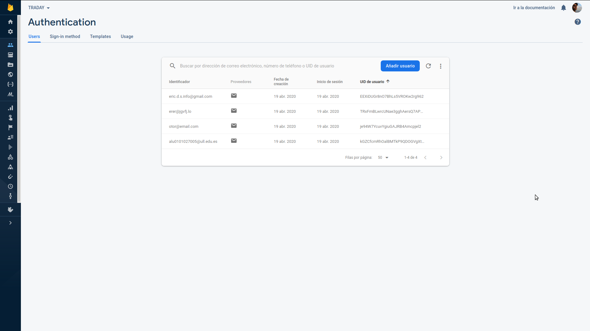
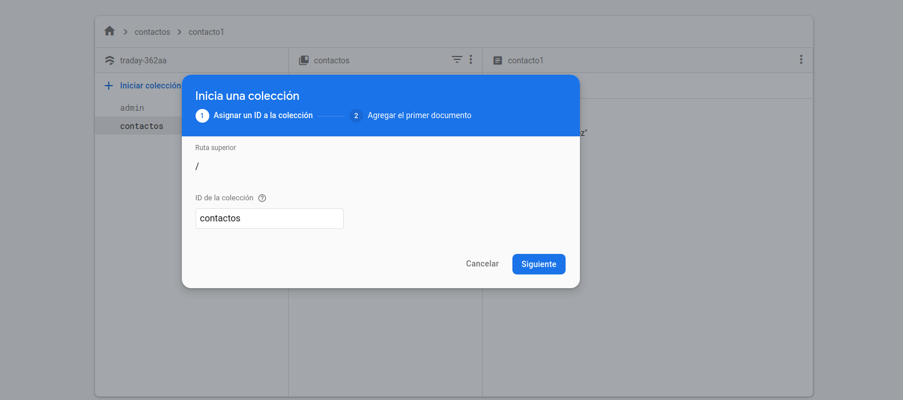
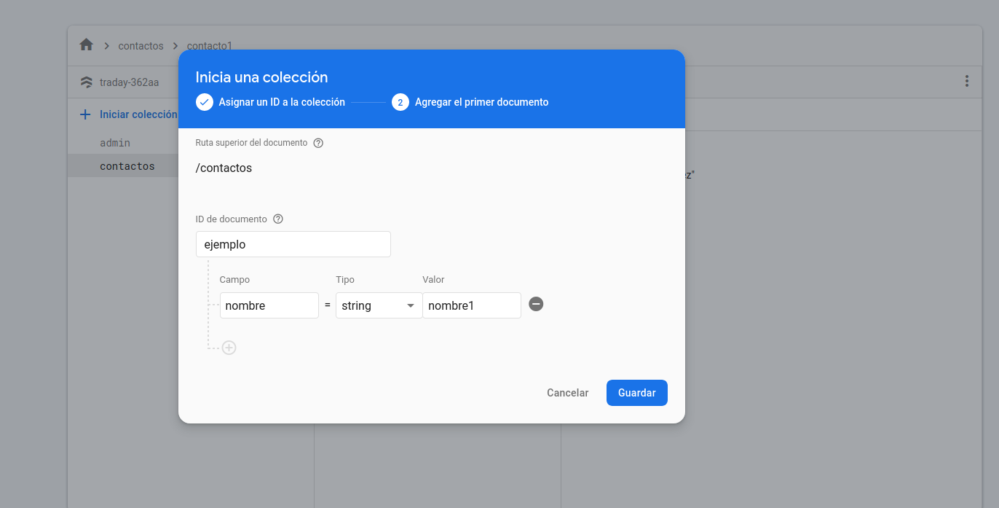
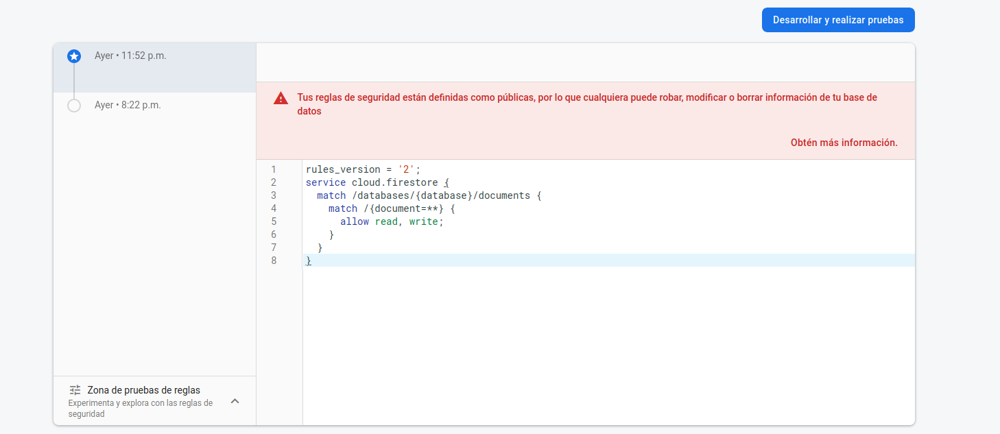

# Informe sobre la práctica primera de Firebase 
    Se pretende explicar el proceso realizado para implementar los servicios de 
    bases de datos de Firebase en el proyecto

## Instalación y configuración de Firebase en el proyecto
    Se explicarán los pasos seguidos y los requisitos implicados en el proceso
    de inicializar Firebase en el repositorio.

### Antes de comenzar
- Tenemos que instalar nuestro editor o IDE preferido (Visual Studio Code, Atom...).
- Abrimos nuestro proyecto de JavaScript (web o Node.js).
- Accedemos a [Firebase](https://console.firebase.google.com/u/0/?hl=es-419) con nuestra cuenta.

### Paso 1: Crea un proyecto de Firebase.

Antes de que podamos agregar Firebase a nuestra app de JavaScript, debemos crear un proyecto de Firebase y conectarlo a la app.

### Paso 2: Registra tu app.

Cuando tengamos un proyecto de Firebase, podremos agregarle nuestra aplicación web.

1. En la página de descripción general del proyecto en Firebase console, hacemos clic en el ícono de **Web (<>)** para iniciar el flujo de trabajo de configuración.

2. Ingresamos el nombre de nuestra app.

3. Configuramos Firebase Hosting para nuestra aplicación web.

    - Seleccionamos un sitio de la lista desplegable para vincularlo a nuestra aplicación web de Firebase. Esta lista muestra el sitio de Hosting predeterminado de nuestro proyecto y cualquier otro sitio que hayamos configurado en él.

### Paso 3: Agrega los SDK de Firebase y, luego, inicializa Firebase

Podemos agregar cualquiera de los [productos que tiene Firebase](https://firebase.google.com/docs/libraries?hl=es) en nuestra app.

Como usamos Firebase Hosting, podemos configurar nuestra app para cargar las bibliotecas del SDK de Firebase JavaScript de manera dinámica desde las URL reservadas. Esta opción de configuración también funciona para probar nuestra aplicación web localmente.

### Paso 4: Instalamos CLI e implementamos el Hosting.

1. Para implementar Firebase, debemos usar [Firebase CLI](https://firebase.google.com/docs/cli?hl=es-419). Esto es una herramienta de línea de comandos. Deberemos ejecutar el siguiente comando npm en la terminal.

        npm install -g firebase-tools

2. Conectamos nuestra máquina local a Firebase y le otorgamos acceso a nuestros proyectos de Firebase:

        firebase login

3. Inicializamos el proyecto de firebase. Consulta más información en este [enlace](https://firebase.google.com/docs/hosting/quickstart?hl=es-419#initialize).

        firebase init

4. Implementamos la configuración de hosting y el contenido en Firebase Hosting.

    - Realizamos la implemenRegistrotación con el comando:

            firebase deploy


## Registro de usuarios para añadir entradas a la base de datos
    Se explicará los cambios en la web y las configuraciones realizadas para
    implementar esta parte de la base de datos. (Login, sign up y logout)

### Configuración

El primer paso para poder realizar cambios en la web y emplear las bases de datos es
poder manejar la autenticación de los usuarios. 

Para poder manejar el estado de las sesiones de usuarios necesitamos instanciar una 
variable que contenga los métodos necesarios. Debemos entonces añadir la siguiente 
linea tras el script de configuración:

```js
    const auth = firebase.auth();
```

Por otro lado se prepararán varios formularios *html* bajo algunos ID que nos permitirán capturar sus valores a posteriori en un programa JavaScript.

_Por ejemplo:_
```html
<form id="signIn"class="col s12 m6 ">
    ···
</form>
```

El código se escribirá en el fichero *firebase-auth.js* que se incluye
en el  ```<head>``` del fichero principal.

Para capturar los formularios usamos:

```js
const signupForm = document.querySelector('#signUp');
```

### Registro (*Sign Up*)

Para llevar a cabo el registro el formulario captura los siguientes valores:
- Nombre de Usuario
- Email
- Contraseña
- Confirmación de contraseña

Usa las *querySelectors* para capturar el formulario, donde podremos volcar cada uno de los valores en variables tras hacer el *submit*.

Para ejecutar bajo el submit usamos:
```js
signupForm.addEventListener('submit', (e)=> {
···
}
```

El si ambas contraseñas coinciden, el *email* y la *contraseña* son añadidos a la base de datos de firebase por medio de la orden:

```js
auth.createUserWithEmailAndPassword(email, password).then(cred => {

    const modal = document.querySelector('#loginModal')
    M.Modal.getInstance(modal).close();
    signupForm.reset();
})
```
Con el *then* lo que indicamos es que solo ejecute lo que contiene si la solicitud se ha cumplido con éxito.

### Inicio de sesión (*Login*)
El proceso para manejar el inicio de sesión en la página es similar al registro. Sin embargo en esta ocasión estamos capturando únicamente el email y la contraseña en el formulario.

Cabe destacar que usa valores ID distintos en este formulario.

En este caso debemos sencillamente enviar los valores capturados a la orden de firebase:

```js
auth.signInWithEmailAndPassword(email, password).then( cred => {
    ...
}
```

Lo cual en caso de ser correcto capturará el estado activo del usuario. De no ser así informará del error concreto.

### Cierre de sesión (*Logout*)
El cierre de sesión del usuario se procesa por medio de la interacción del botón. Cuando el usuario lo pulsa ejecuta la orden para reflejar este cambio en Firebase. La orden es la siguiente:

```js
logOut.addEventListener('click', (e) => {
···
}
```

### Puntos en común
- Todos los formularios son cerrados y limpiados ante un *input* correcto.
- Todos los formularios están dentro de un modal que se activa al pulsar el botón.
- Todos los campos de email usan la validación del campo por defecto.
### Resultados en Firebase
A continuación se puede apreciar como se guardan los usuarios en firebase tras la consulta de registro:



Esta consola informa de:
- Identificador (*email*)
- Proveedor (*email + contraseña*)
- Fecha
- UID

## Registro de entradas en la base de datos del servidor Firebase
    Se procede a indicar los pasos seguidos en la implementación de la base de datos
    así como el registro de entradas desde la aplicación web.

### Configuración de Firebase 

Antes de comenzar, aclarar que para la realización de este apartado hemos hecho uso de las consultas a tiempo real que nos proporciona Firebase, y se trata de Cloud Firestore. Realiza actualizaciones en tiempo real, consultas poderosas y ajuste de escala automático.

En primer lugar, para poder llevar a cabo el Registro de entradas en la Base de Datos del Servidor Firebase desde nuestra web, procederemos a establecer una "colección". Dentro del apartado de Database de nuestro Servidor Firebase, se nos permitirá crear una colección con los diferentes datos que queramos añadir de forma manual a nuestra Base de Datos. El procedimiento se muestra a continuación: 


    
Como podemos ver en la imagen que se muestra con anterioridad, se nos habilita un espacio donde introducir un ID para nuestra nueva colección. Procederemos a crearla y se nos mostrará a continuación la siguiente ventana, donde rellenaremos los datos correspondiendes a la nueva colección.



Comentar que, además se nos proporciona la posibilidad de establecer unas normas referente a los usuarios. En este caso, no hemos cambiado las líneas de código más allá de modificar la línea para habilitar los permisos de escritura y lectura para todos los usuarios. Esta es una mala práctica, debido a que cualquier usuario que acceda a nuestra web, tendría acceso a la lectura y escritura de la base de datos.



### Fichero JavaScript

