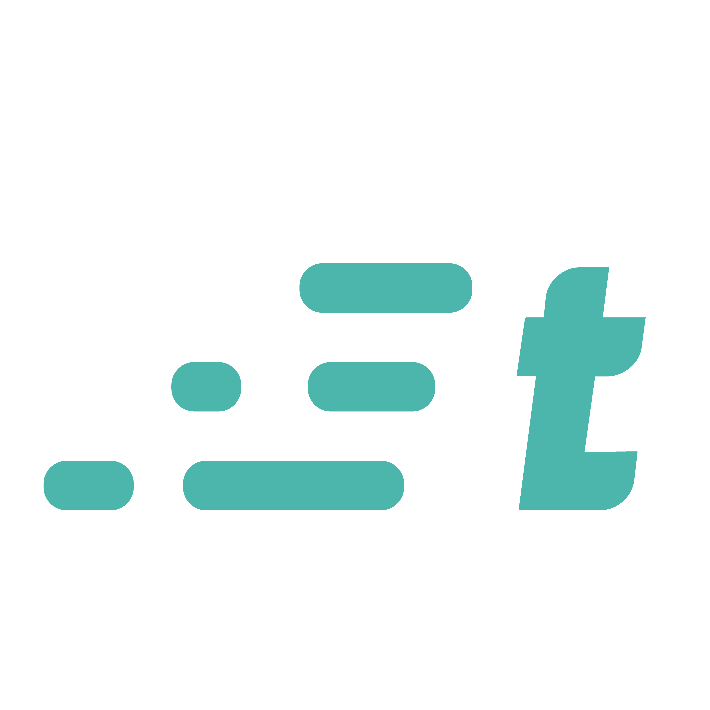
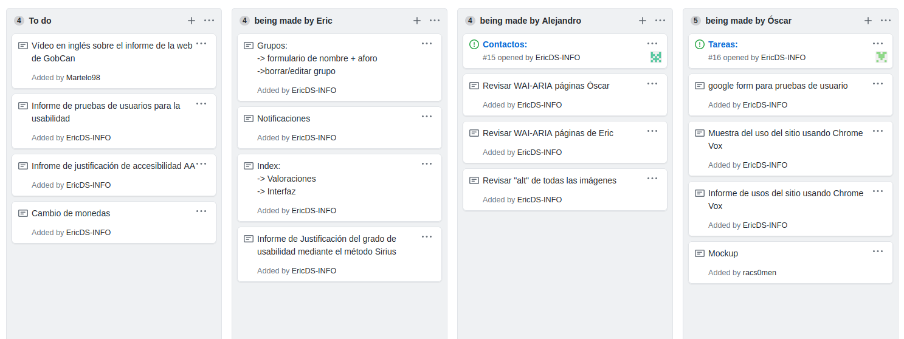

# Informe del prototipo del banco de tiempo | Traday

En este documento presentamos algunos de los apartados de interés relacionados con el desarrollo y conclusión del prototipo de la página web propuesta.

La página web propuesta es un banco de tiempo que hemos denominado como Traday (trade your day), una herramienta mediante la cual los usuarios podrán gestionar grupos, contactos y traeas  que serán administradas y equilibradas mediante backend. 

La página se rige por un diseño minimalista y moderno, con una imagen de marca propia que se trata de seguir con rigurosidad y en base a la filosofía de diseño [Material de Google](https://material.io/design). El aspecto y funcionalidad de los elementos se basan, en su mayoría, en el framework de CSS **Materialize** combinado con archivos CSS propios. También se han implementado librerías externas para animaciones y otros aspectos. 

El backend viene implementado por Firebase y la funcionalidad lógica de la página se basa en una mezcla homogénea de esta librería y algunas funciones complementarias de JavaScript

## Justificación de los criterios de conformidad AA según WCAG 2.1

## Mockups de diseño responsivo de la web

## Informe de usos mediante lectores de pantalla | muestra de uso con Chrome Vox

En este apartado examinaremos como ha reaccionado nuestra página del banco de tiempo a un lector de pantalla como es Chrome Vox. Los problemas encontrados no fueron muy grandes, la mayoría pudieron ser solucionados con **aria-label=""** para aquellos errores que ocurrieron en los botones y **tabindex="0"** para aquellos errores en los que el foco se saltaba un elemento.

### Muestra del uso de Chrome Vox

Para finalizar, en el siguiente vídeo pueden ver una muestra de cómo reacciona Chrome Vox a nuestra web:

## Justificación del grado de usabilidad | Método Sirius

En este apartado hemos aplicado la checklist de revisión Heurisitica del Método Sirius a la página web [TRADAY](https://traday-362aa.web.app/index.html) con el fin de evaluar cuán usable es. 

Por lo general, la web cumple los Requerimientos Heurísticos de Aspectos Generales satisfactoriamente con la excepción de que los objetivos de la web no son tan concretos o están definidos como podría esperarse, además de que no se da soporte a otros idiomas.

En cuanto a la Identidad e Información de la web, todos los aaspectos se cumplen sastisfactoriamente, salvo el punto de ofrecer información sobre autor, fuentes y fechas de creación que no aplican en nuestra web.

Por otro lado, en el apartado de Estructura y Navegación, la web cumple de manera adecuada mucho de los puntos que se proponen como requerimiento, en excepción de algunos como es que no existen enlaces que lleven a la misma página en la que nos encontramos.

Ademas, por parte del Rotulado, la mayoría de requerimientos se cumplen satisfactoriamente en lo referente al diseño de la web, como son el logotipo de identidad de marca y el uso de títulos sencillos. Sin embargo, los apartados referentes a las URLs no se aplican ya que no poseemos un dominio propio ni un backend suficiente como para administrar URLs.

El Layout de la página se cumple satisfactoriamente y con alta puntuación en casi todos sus apartados, salvo en la versión impresa que ene este caso no aplica.

Para el apartado de Entendibilidad y Facilidad, al igual que mucho de los apartados anteriores, se cumple casi a la perfección, de no ser por el criterio de la selección de campo en lugar de la escritura, que no se cumple en todo el sitio.

En el Apartado Control y Retroalimentación, hay algunos apartados que no se aplican. La información al usuario sobre lo que estrá pasando no tiene relevancia porque no hay procesos que se realicen en vivo, ni que dichos procesos tengan una interacción que requiera varios pasos.

Con respecto al apartado Multimedia, prácticamente todos los requerimientos se cumplen correctamente, exceptuando que no se hace uso de sonidos en la página, no se aplica.

Por último, al no tener secciones de Ayuda o bloques de Búsqueda en la web no se aplican.

Con todo esto, el porcentaje de accesibilidad de la web cae en un 91.04%.

## Documentación de pruebas de usuarios

<<<<<<< HEAD
En este apartado se hablará acerca de las pruebas de usuarios que hemos aplicado en nuestra web. Como los casos de uso no difieren mucho de tipo de usuario que va a usar la aplicación hemos optado por generalizar una tarea que puede ser común a cualquier tipo de usuario, siendo aún así registrado el ámbito de uso de la web para el usuario. 

En el siguiente documento se le presenta un formato textual que representa las pruebas de usuarios aplicadas a la página:

- [pruebas de usuario](./PRUEBAS-USUARIO.md)

Sin embargo para la recopilación de los datos de esta prueba se ha habilitado un formulario de Google que es accesible desde la página principal de la web. Ya que la tarea puede adecuarse a cualquier usuario registramos el tipo de usuario para tenerlo en cuenta en las métricas. De la misma manera se puede acceder al informe de resultados desde la misma página web.

- [acceso a la web](https://traday-362aa.web.app/)

En general, tal y como muestra el [informe](https://docs.google.com/forms/d/1TNGVwlrxmyuZ6fTtKtwjjY2ktNqsoqDNm5Z4GNP2Fv0/viewanalytics), los usuarios han sido capaces de ralizar la tarea sin la mayor de las dificultades. En este caso la mayoría de los usuarios han sido estudiantes (un 66,7%). Sin embargo las acciones dentro de la propia web podrían verse mejor explicadas pese a que encontrarlas ha sido sencillo para la mayoría de los casos. El tiempo de realización de la tarea propuesta no ha llevado más de 15 minutos en ninguno de los casos.

=======
***
>>>>>>> UyA-Practicas/informeProyecto-conclusion
## Conclusiones del prototipo

***
En valoración con los objetivos propuestos en un principio con este prototipo, se han conseguido muchos de ellos, además de incluso proponer e implementar nuevos en el transcurso de la creación del mismo. A lo largo del desarrollo del proyecto, se han tenido una serie de dificultades las cuales han sido tomadas propiamente como retos en sí mismas. Un ejemplo de esto fue la implementación de una base de datos haciendo uso de la herramienta que nos proporciona Firebase. Tras leer documentación y llegar a errores, ha sido posible la lectura y escritura en la base de datos a través de algunas de las páginas de la web.
Otro punto muy importante a destacar en lo que ha sido el desarrollo del proyecto, es la importancia que se le ha dado a hacer uso de las herramientas que se nos ha proporcionado a lo largo del curso en la asignatura, teniendo muy encuenta los criterios aprendidos sobre la accesibilidad y la usabilidad. Se ha intentado ser bastante detallista en este sentido, comprobando que absolutamnte todo fuera útil y accesible por diferentes medios, como es vía táctil, ratón y teclado. 

## Justificación del trabajo en grupo | reparto de tareas

<<<<<<< HEAD
Dado que todo el desarrollo del proyecto se ha empleado la plataforma GitHub hemos decidido usar la misma para llevar el trabajo colaborativo. Las herramientas que github brinda son suficientes para el reparto de tareas, el control de las aportaciones de los miembros  y la coordinación entre las partes que componen el desarrollo. 

Para asignar las tareas se ha usado la herramienta "GitHub Projects" que permite establecer una serie de tablas que simbolizan el estado de las tareas, entre estas se moverán unas tareas que compondrán partes de los distintos apartados del desarrollo, nuestra disposiciṕn es la siguiente:

Tal como se puede observar se van acumulando las tareas pendientes en una de las columnas, para luego ser atendidas por uno de los miembros, para señalizar esto se desplaza a la columna de cada miemnbro.

Por otro lado se ha usado el diseño de ramas de git para, a partir de una rama base, separar cada uno de las categorías y apartados que se han ido trabajando. Este modo de trabajo permite el uso simultaneo del directorio del proyecto sin pisar ni sobreescribir el trabajo entre los compañeros, el cual además en caso de conflicto se puede solucionar facilmente comparando las dos versiones que hay disponibles. Se separan tres tipos de ramas principales "master" que será donde residan las distintas versiones finales del producto, "develop" que será donde se desarrollen todos los aspectos del proyecto y el resto de ramas, que colgarán de develop y permitirán separar las distintas tareas y a repartición de las mismas. "master" será transparente a las ramas que cuelgan de develop para evitar conflictos en el producto final.

Al menos dos veces a la semana se han hecho reuniones para valorar el estado actual de la web y establecer las tareas pendientes y su repartición. Por lo general la carga de trabajo es equitativa. Estas sesiones se hacen mediante videollamada y en ellas resolvemos dudas, compartimos trabajo realizado y unimos las ramas para evitar conflictos.

## Enlaces a documentos de soporte de las justificaciones | checklist
=======
## Enlaces a documentos de soporte de las justificaciones | checklist

>>>>>>> UyA-Practicas/informeProyecto-checklist
