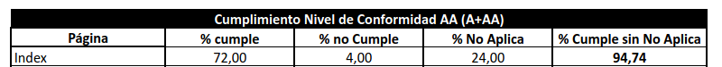

# Informe del prototipo del banco de tiempo | Traday

En este documento presentamos algunos de los apartados de interés relacionados con el desarrollo y conclusión del prototipo de la página web propuesta.

La página web propuesta es un banco de tiempo que hemos denominado como Traday (trade your day), una herramienta mediante la cual los usuarios podrán gestionar grupos, contactos y traeas  que serán administradas y equilibradas mediante backend. 

La página se rige por un diseño minimalista y moderno, con una imagen de marca propia que se trata de seguir con rigurosidad y en base a la filosofía de diseño [Material de Google](https://material.io/design). El aspecto y funcionalidad de los elementos se basan, en su mayoría, en el framework de CSS **Materialize** combinado con archivos CSS propios. También se han implementado librerías externas para animaciones y otros aspectos. 

El backend viene implementado por Firebase y la funcionalidad lógica de la página se basa en una mezcla homogénea de esta librería y algunas funciones complementarias de JavaScript
***

## Justificación de los criterios de conformidad AA según WCAG 2.1

***

Haciendo uso de la herramienta **AUDIT-TOOL WCAG 2.1** se ha realizado una evaluación de los criterios de conformidad de nivel AA sobre la web [Evaluación de Criterios](https://drive.google.com/file/d/1boCzVjNc-cQNNq7KeejJevmiZ-FiIU3K/view?usp=sharing)
Al finalizar la evaluación, podemos observar que el criterio AA se ha cumplido en un 72%, que no se ha cumplido en un 4%, y que no se ha aplicado en un 24% de Pautas. 
La gran parte de criterios que no se aplican vienen dados a que el contenido de la web no incluye en absoluto vídeos ni reproductores de sonido.

### Éxitos

Tal y como se observa, el número de criterios de la valuación que se cumple es realmente elevado, debido al interés y esfuerzo que se ha dado para que la web sea lo mas accesible posible. Ejemplos de cumplimiento están, sobretodo en su mayoría relacionados con la limprieza y orden de los elementos de la web, además del uso correcto del dimensionado de imagenes.
Se ha llevado a cabo, además, teniendo bastante en cuenta que el sitio sea responsive, pudiendo ser dimensionada practicdamne para cualquier dimensión. Para ello, se ha tenido en cuenta el uso de la técnica **Mobile-First**, teniendo como primer objetivo el diseño en primer lugar del dispositivo más limitado. Se han priorizado contenidos y funcionalidades, eliminando todos aquellos elementos que no son útiles, dando un formato sencillo, legible y minimalista.
Ademaś, se ha tenido muy en cuenta el uso del "foco" para el manejo de la web desde teclado.

### Errores

Como único error que se encuentra en la web, que propiamente podría considerarse como error leve, se trata del Criterio: 

- **Ayuda 3.3.3:** Si se encuentra un error al introducir un dato, deberáde explicar y proporcionar sugerencias en formato de texto para solucionar de forma oportuna y accesible.

No se ha llevado el control de dicho criterio en la web, por ejemplo en el apartado de "Añadir Contacto", uno de los campos que se solicitan se trata del email del contacto a añadir. En este caso, no se ha puesto restricción de ningún tipo, por lo que el usuario podría ingresar un formato de correo no correcto y aún así, se añadiría a la base de datos de Firebase. Una mejor implementación permitiría conocer que dirección de correo electrónico es correcta y cuál no. En caso de no ser correcta, se le debería de mostrar un error junto con un ejemplo una ayuda al usuario, indicando el formato de email aceptado o posible.

## Mockups de diseño responsivo de la web

## Informe de usos mediante lectores de pantalla | muestra de uso con Chrome Vox

## Justificación del grado de usabilidad | Método Sirius

## Documentación de pruebas de usuarios

## Conclusiones del prototipo

## Justificación del trabajo en grupo | reparto de tareas

## Enlaces a documentos de soporte de las justificaciones | checklist