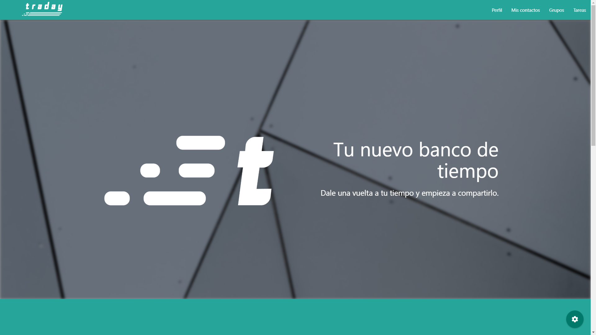
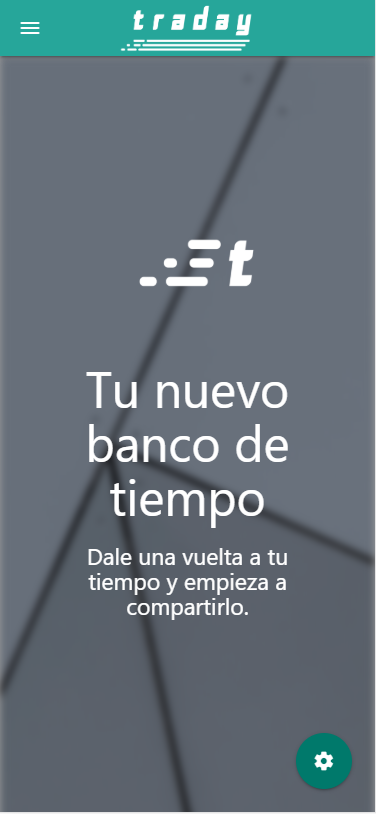
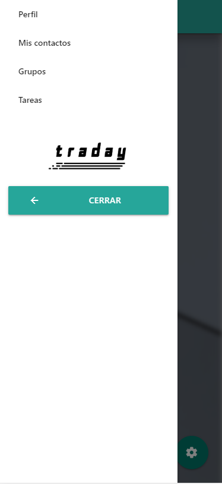
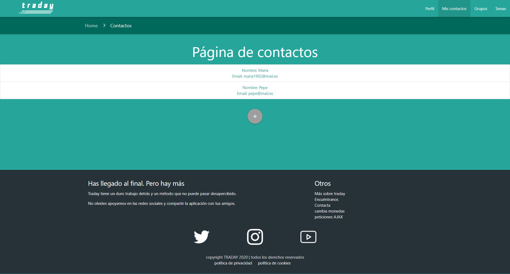
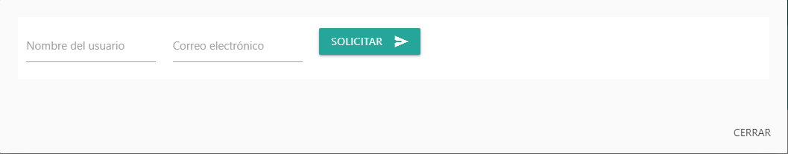
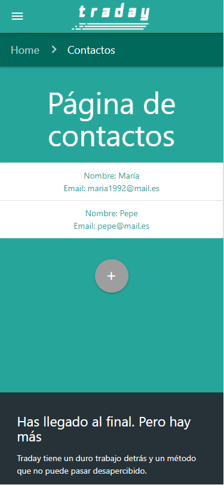
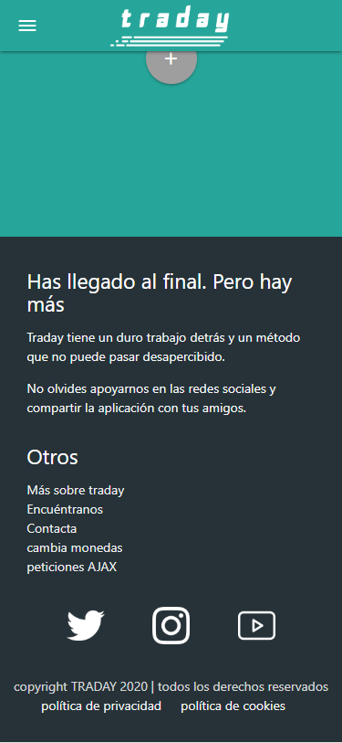
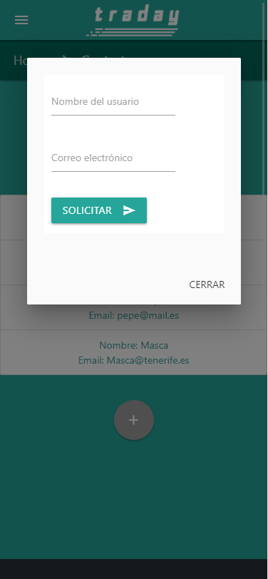

# Informe del prototipo del banco de tiempo | Traday

En este documento presentamos algunos de los apartados de interés relacionados con el desarrollo y conclusión del prototipo de la página web propuesta.

La página web propuesta es un banco de tiempo que hemos denominado como Traday (trade your day), una herramienta mediante la cual los usuarios podrán gestionar grupos, contactos y traeas  que serán administradas y equilibradas mediante backend. 

La página se rige por un diseño minimalista y moderno, con una imagen de marca propia que se trata de seguir con rigurosidad y en base a la filosofía de diseño [Material de Google](https://material.io/design). El aspecto y funcionalidad de los elementos se basan, en su mayoría, en el framework de CSS **Materialize** combinado con archivos CSS propios. También se han implementado librerías externas para animaciones y otros aspectos. 

El backend viene implementado por Firebase y la funcionalidad lógica de la página se basa en una mezcla homogénea de esta librería y algunas funciones complementarias de JavaScript

## Justificación de los criterios de conformidad AA según WCAG 2.1

## Mockups de diseño responsive de la web

En este apartado realizaremos un Mockup para mostrar como se ve nuestra web en distintos formatos de pantalla. Las resoluciones empleadas han sido la de una pantalla de un portátil y la de un teléfono móvil Iphone X. Además, usamos como referencia la página principal de Traday y la sección de contactos.

### Página principal tamaño grande

En la imagen inferior se puede observar como se vería el index de Traday con una resolución de pantalla portátil. Se puede ver como el navbar está desplegado, a diferencia de la versión móvil que se verá más adelante.

### Página principal tamaño móvil

La primera imágen corresponde a como se vería la web con un formato de un teléfono móvil Iphone X, en la cual el navbar ha sido sustituído por un menú *hamburger*, sobre el que si pulsas, se despliega el menú que hay en la segunda imágen. De esta forma, nuestra página se puede adaptar a cualquier formato de pantalla.

### Página de contactos tamaño grande

En esta sección de Traday, ocurre lo mismo que explicamos antes con el navbar. Además, observaremos que el contenido del interior de la página, el formulario y el footer también son completamente responsive.

### Página de contactos tamaño móvil

Como se nombró antes, en la primera imagen de abajo, se comprueba que el contenido de la sección de contactos en tamaño móvil se adapta al cambio de resolución. En la segunda imagen se puede comparar cómo se ve el footer en tamaño móvil a cómo se veía en el apartado anterior con pantalla grande (la sección de "otros" ha pasado de estar a la derecha, a estar debajo de la sección "has llegado al final"). Por último, en la tercera imágen está el formulario para agregar a un contacto si accedes desde un dispositivo, mientras que en el apartado anterior está en formato pantalla grande (la parte de "correo electrónico" se pone debajo de la de "nombre de usuario", mientras que en la versión grande está a la derecha).

## Informe de usos mediante lectores de pantalla | muestra de uso con Chrome Vox

## Justificación del grado de usabilidad | Método Sirius

## Documentación de pruebas de usuarios

## Conclusiones del prototipo

## Justificación del trabajo en grupo | reparto de tareas

## Enlaces a documentos de soporte de las justificaciones | checklist