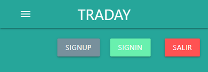
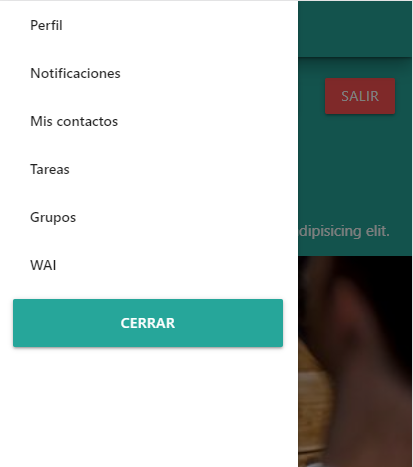
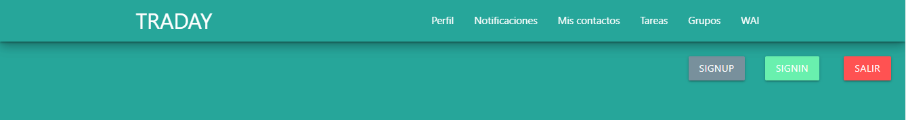
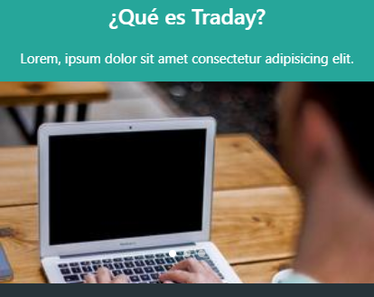
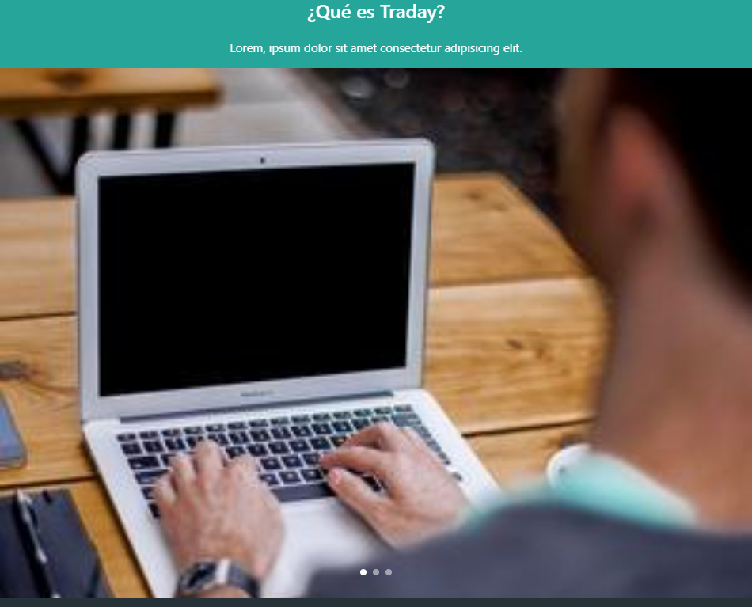
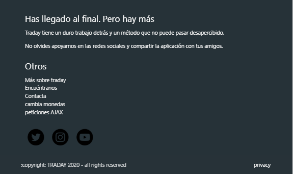
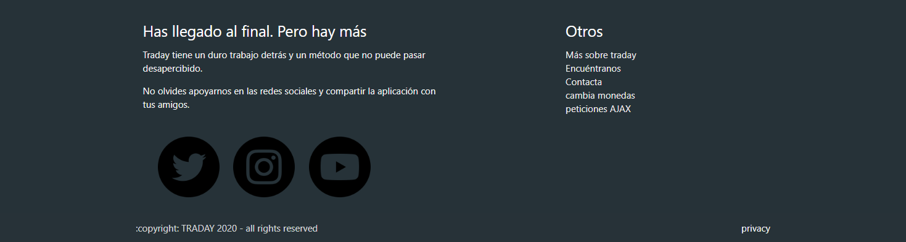

# Diseño responsive | desarrollo mobile first.

Se va a incluir, en dos pasos, el desarrollo responsive para la página de inicio. En primer lugar un análisis sobre los elementos html, bajo la filosofía mobile first acerca de qué elementos deberían incluirse en esta página. El siguiente paso sería completar este HTML con el CSS necesario para que se cumpla un diseño responsive.

## Página de inicio preparada bajo mobile first.

```html


<!DOCTYPE html>
<html lang="es">
<head>
    <meta charset="UTF-8">
    <meta name="viewport" content="width=device-width, initial-scale=1.0">

    <title>traday - home</title>
</head>
<body class="">
     
  <!-- inicio de sesión + registro  -->    
  
    <!-- Navegación en la web -->    

      <!-- --- -->    

      <div>
        <nav>
          <div>
            <div>
              <a href="index.html" aria-label="Traday">
                TRADAY
              </a>
              <a href="#" data-target="traday-nav"
                          aria-expanded="false"
                          aria-label= "accionar menú lateral  "
                          onclick="changeValues(event)"
                          onkeydown="changeValues(event)">
                <i>menu</i>          
              </a>
            
              <ul role="navigation" aria-label="Barra superior">
                <li><a href="profile.html">Perfil</a></li>
                <li><a href="#">Notificaciones</a></li>
                <li><a href= "contacts-page.html">Mis contactos</a></li>
                <li><a href="#">Tareas</a></li>
                <li><a href="#">Grupos</a></li>
                <li ><a href="waiaria.html">WAI</a></li>
            
              </ul>
            </div>
          </div>
        </nav>
      </div>

      <!-- Menú Lateral --> 
      <ul aria-label="Menú de navegación lateral">
          <li ><a tabindex="-1" href="profile.html" aria-label="ir al perfil">Perfil</a></li>
          <li ><a tabindex="-1" href="#" aria-label="ir a notificaciones">Notificaciones</a></li>
          <li ><a tabindex="-1" href= "contacts-page.html" aria-label="ir a mis contactos"> Mis contactos</a></li>
          <li ><a tabindex="-1" href="#" aria-label="ir a mis tareas">Tareas</a></li>
          <li ><a tabindex="-1" href="#" aria-label="ir a mis grupos">Grupos</a></li>
          <li ><a tabindex="-1" href="waiaria.html" aria-label="ir a wai aria">WAI</a></li>
          <li ><a tabindex="-1" href="#!" aria-label="cerrar menú lateral"
                onclick="nullValues(event)" onkeydown="nullValues(event)">Cerrar</a></li>
        </ul>
    
        <!-- Botones de usuario --> 
        <div>
          <div>
            <button aria-label="registro"
                    role="button" 
                    href="#loginModal">signup
            </button>
          </div>
          <div>
            <button aria-label="inicio de sesión"
                    role="button" 
                    href="#signInModal">signin
            </button>
          </div>
          <div>
            <button aria-label="cierre de sesión"  
                    role="button" 
                    id="logout">salir
            </button>
          </div>
        </div>

        <!-- Tablas de secciones informativas --> 
        <div>
          <div href="#one!">
            <h2>¿Qué es Traday?</h2>
            <p>This is your first panel</p>
          </div>
          <div href="#two!">
            <h2>Valoraciones</h2>
            <p>This is your second panel</p>
          </div>
          <div href="#three!">
            <h2>Nuestro equipo</h2>
            <p>This is your third panel</p>
          </div>
        </div>


    <!-- footer --> 
    <footer class="">
    </footer>
  
</body>
</html>

```
Para el diseño de los contenidos, de cara a hacerlo lo más adecuado posible para todos los dispositivos, se ha empleado la metodología ***mobile first***. Con esto pretendemos que el sitio que diseñamos sea lo más usable posible por el dispositivo más limitado.

De cara a reducir los contenidos se ha planteado esta página de inicio como una ***landing page*** las cuales pretenden ser claras y concisas en cuanto a información con la finalidad de captar usuarios y proporcionar una visión global del sitio empleando pocos recursos. 

Tal como se puede ver en el código plasmado arriba la página se divide en tres secciones principales: cabecera de navegación y registro, contenidos informativos y footer.

Para la navegación hemos empleado una alternativa que incluirá una barra de navegación clásica optando a un menú lateral desplegable para pantallas más reducidas como la de los móviles. Es por esto que a parte de la lista de secciones de navegación se incluye otra similar bajo la que envuelve la etiqueta nav.

En cuanto a los contenidos de información se ha optado por ponerlo de la manera más condensada posible, por ello un ***carrousel*** será la herramienta que emplearemos para presentarlo paulatinamente en el mismo sitio. De esta manera no forzamos al usuario a tener que estar desplazando mucho contenido en vertical por si los elementos se tuvieran que adaptar a un dispositivo móvil. Ya que en estos penaliza que el usuario tenga que desplazarse de manera vertical, que el contenido esté accesible horizontalmente y de manera escueta es más positivo para la mayoría de las pantallas.

El fóoter será presentado con todos los enlaces a redes sociales y páginas secundarias además de informaciones relativas al copyright y políticas del sitio, ya que por costumbre el usuario suele ubicar estos contenidos en esa zona. Posicionarlo al final de la página, paradógicamente, lo hace más usable y de acceso más rápido.

## Página de inicio ya estilizada de forma responsive.


```html


<!DOCTYPE html>
<html lang="es">
<head>
    <meta charset="UTF-8">
    <meta name="viewport" content="width=device-width, initial-scale=1.0">

    <!-- Materialize CSS file -->
    <link rel="stylesheet" href="media/css/materialize.min.css" 
    media="screen, projection"/>

    <!-- Materialize JS file -->
    <script defer type="text/javascript" src="media/js/materialize.min.js"></script>

    <!-- Personal JS file -->
    <script defer type="text/javascript" src="media/js/index.js"></script>

    <!-- Google Icon Font-->
    <link href="https://fonts.googleapis.com/icon?family=Material+Icons" 
    rel="stylesheet">
    
    <title>traday - home</title>
</head>
<body class="teal lighten-1">
     
  <!-- inicio de sesión + registro  -->    
  
    <!-- Navegación en la web -->       

    <div class="navbar-fixed hoverable ">
      <nav>
        <div class="nav-wrapper teal lighten-1">
          <div class="container">
            <a href="index.html" class="brand-logo" aria-label="Traday">
              TRADAY
            </a>
            <a href="#" data-target="traday-nav"
                        class="sidenav-trigger"
                        aria-expanded="false"
                        aria-label= "accionar menú lateral  "
                        onclick="changeValues(event)"
                        onkeydown="changeValues(event)">
              <i class="material-icons">menu</i>          
            </a>
          
            <ul class="right hide-on-med-and-down"
                role="navigation" aria-label="Barra superior">
              <li><a href="profile.html">Perfil</a></li>
              <li><a href="#">Notificaciones</a></li>
              <li><a href= "contacts-page.html">Mis contactos</a></li>
              <li><a href="#">Tareas</a></li>
              <li><a href="#">Grupos</a></li>
              <li ><a href="waiaria.html">WAI</a></li>
          
            </ul>
          </div>
        </div>
      </nav>
    </div>

      <!-- Menú Lateral --> 
      <ul 
          class="sidenav" id="traday-nav"
          aria-label="Menú de navegación lateral">
          <li ><a tabindex="-1" href="profile.html" aria-label="ir al perfil">Perfil</a></li>
          <li ><a tabindex="-1" href="#" aria-label="ir a notificaciones">Notificaciones</a></li>
          <li ><a tabindex="-1" href= "contacts-page.html" aria-label="ir a mis contactos"> Mis contactos</a></li>
          <li ><a tabindex="-1" href="#" aria-label="ir a mis tareas">Tareas</a></li>
          <li ><a tabindex="-1" href="#" aria-label="ir a mis grupos">Grupos</a></li>
          <li ><a tabindex="-1" href="waiaria.html" aria-label="ir a wai aria">WAI</a></li>
          <li ><a tabindex="-1" href="#!" class="sidenav-close btn" aria-label="cerrar menú lateral"
                onclick="nullValues(event)" onkeydown="nullValues(event)">Cerrar</a></li>
        </ul>
    
      <br>
        <!-- Botones de usuario --> 
        <div class="row center-align">
          <div class="col s3 m2 l1 offset-s3 offset-m6 offset-l9 center-align" >
            <button aria-label="registro"
                    role="button"
                    class="waves-effect blue-grey lighten-1 btn modal-trigger" 
                    href="#loginModal">signup
            </button>
          </div>
          <div class="col s3 m2 l1  center-align">
            <button aria-label="inicio de sesión"
                    role="button"
                    class="waves-effect waves-light green accent-2 btn modal-trigger" 
                    href="#signInModal">signin
            </button>
          </div>
          <div class="col s3 m2 l1  center-align">
            <button aria-label="cierre de sesión"  
                    role="button"
                    class="waves-effect waves-light red accent-2 btn modal-trigger" 
                    id="logout">salir
            </button>
          </div>
        </div>

        <!-- Tablas de secciones informativas --> 
        
          <div class="carousel carousel-slider center">
            <div class="carousel-item teal lighten-1 white-text" href="#one!">
              <h2>¿Qué es Traday?</h2>
              <p class="white-text">Lorem, ipsum dolor sit amet consectetur adipisicing elit.</p>
              
            </div>
            
            <div class="carousel-item grey white-text" href="#two!">
              <h2>Valoraciones</h2>
              <p class="white-text">Lorem, ipsum dolor sit amet consectetur adipisicing elit.</p>
              
            </div>
            
            <div class="carousel-item grey white-text" href="#three!">
              <h2>Contacto</h2>
              <p class="white-text">Acceder al contacto</p>
              <button aria-label="inicio de sesión"
                    role="button"
                    class="waves-effect waves-light green accent-2 btn modal-trigger" 
                    href="#signInModal">Aquí
              </button>
            </div>
          </div>
        


    <!-- footer --> 
    <footer class="page-footer blue-grey darken-4">
      <div class="container">
        <div class="row">
          <div class="col l6 s12">
            <h5 class="white-text">Has llegado al final. Pero hay más</h5>
            <p class="grey-text text-lighten-4">Traday tiene un duro trabajo detrás y un método que no puede pasar desapercibido.</p>
            <p class="grey-text text-lighten-4">No olvides apoyarnos en las redes sociales y compartir la aplicación con tus amigos.</p>
            
          </div>
          <div class="col l4 offset-l2 s12">
            <h5 class="white-text">Otros</h5>
            <ul>
              <li><a class="grey-text text-lighten-3" href="#!">Más sobre traday</a></li>
              <li><a class="grey-text text-lighten-3" href="#!">Encuéntranos</a></li>
              <li><a class="grey-text text-lighten-3" href="#!">Contacta</a></li>
              <li><a class="grey-text text-lighten-3" href="exchange.html">cambia monedas</a></li>
              <li><a class="grey-text text-lighten-3" href="ajax-page.html">peticiones AJAX</a></li>
            </ul>
          </div>
        </div>
      </div>
      <div class="row ">
        <div class="col s2 m1 offset-s1 offset-m1 offset-l2">
          <a href="#">
            
          </a>
        </div>
        <div class="col s2 m1 ">
          <a href="#">
            
          </a>
        </div>
        <div class="col s2 m1 ">
          <a href="#">
            
          </a>
        </div>
      </div>
      <div class="footer-copyright">
        <div class="container">
        :copyright: TRADAY 2020 - all rights reserved
          <a class="grey-text text-lighten-4 right" href="#!">privacy</a>
        </div>
      </div>
    </footer>


    <script
              src="https://code.jquery.com/jquery-3.4.1.js"
              integrity="sha256-WpOohJOqMqqyKL9FccASB9O0KwACQJpFTUBLTYOVvVU="
              crossorigin="anonymous"></script>
    <script type="text/javascript" >
      $(document).ready(function(){

        $('.carousel').carousel({
          fullWidth: true,
          indicators: true
        });

        $('.next').click(function(){
          $('.carousel').carousel('next');
        });

        $('.prev').click(function(){
          $('.carousel').carousel('prev');
        });

      })
    </script>

   
</body>
</html>

```
En esta sección se pretende analizar la página de inicio de nuestra web con formato responsive ya implementado, haciendo especial incapié en comparar cómo se ve la página en un móvil y cómo se ve en una pantalla grande.

### Sección del navbar

Esta es una de las partes más críticas a la hora de hacer una página responsive, ya que si no se hace de forma correcta, cuando cambies de pantalla grande a móvil podrían perderse la mayoría de los enlaces de la cabecera de la página. Para arreglar esto hicimos uso de Wai-aria para conseguir un resultado como el siguiente:



Como se puede observar, empleamos una cabecera de tipo "hamburger" para que al acceder a nuestra página desde un dispositivo móvil, se viera todo el navbar correctamente. Además, si la persona presiona sobre este icono se desplegará toda la información que contenía la cabecera:



De esta forma, cuando una pantalla sea mayor de unos píxeles determinados pasará de la forma enseñada anteriormente a una versión expandida del navbar:




### Sección del carrusel

Esta sección de nuestra página también es importante aplicarle responsive de forma correcta, ya que este tipo de formato para enseñar la información, es bastante delicado a cambios de pantalla. Si por ejemplo pasas de una pantalla grande a una pequeña, puede que los botones inferiores que te permiten cambiar de izquierda a derecha se deslicen sobre otra cosa impidiendo así su uso. Por lo tanto, aquí también aplicamos especial atención:



Aunque no se pueda observar detalladamente por la calidad de la captura del carrusel en formato móvil, sobre la mano de la persona hay 3 puntos que nos indican en qué parte del carrusel nos encontramos. Como se puede ver, incluso estando en formato pantalla pequeña, no hay ningún problema para cambiar de zona. Para compararlo con el carrusel en versión pantalla grande dejo a continuación una captura de este:



Como esta captura no cae sobre un fondo blanco si que se puede observar mejor los tres puntos que nos permiten movernos por el carrusel.

### Sección del footer

Esta es la última sección que vamos a comentar, ya que consideramos que también es delicada hacerla responsive, porque como en el navbar, una mala práctica podría hacer que se pierda información valiosa para el usuario. Por ello, en formato móvil hicimos lo siguiente:



Como se puede observar en la imagen anterior, no hay ninguna palabra encima de otra, si no que está todo bien ordenado y colocado aunque accedas a nuestra página desde un dispositivo móvil. Si quisieras entrar con un dispositivo que tenga una pantalla más grande también podrías ver todo correctamente:



Si comparamos las dos imágenes, se puede ver como en la versión móvil la sección de "Otros" se ha puesto debajo de la de "Has llegado al final" mientras que en la versión con pantalla grande se ha puesto a su derecha.

### Conclusiones

Con estos tres puntos delicados hemos sido capaces de implementar una página de forma responsive para cualquier tipo tamaño de pantalla. Esto es muy importante ya que, como se había comentado antes, una mala práctica puede llevar a que el usuario se desoriente o pierda parte de la información que le queremos hacer llegar.

